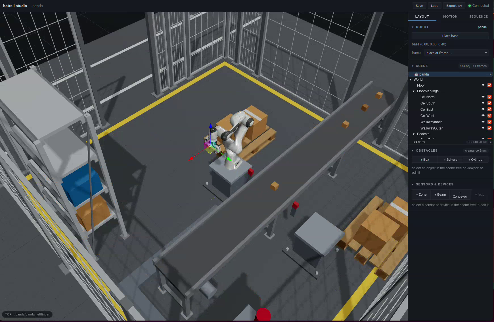
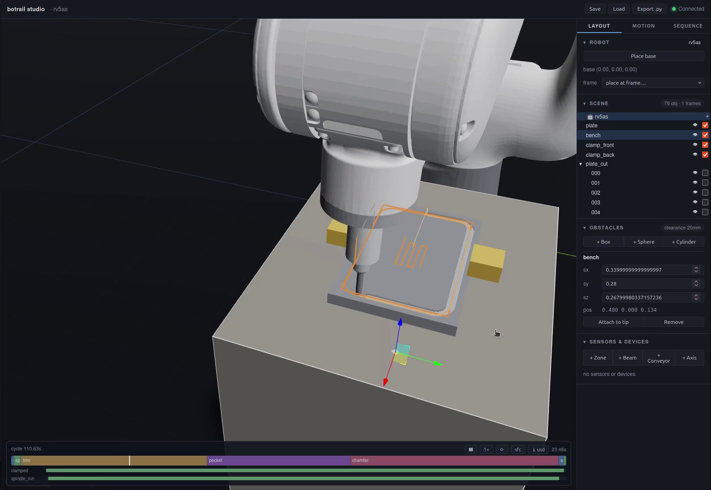
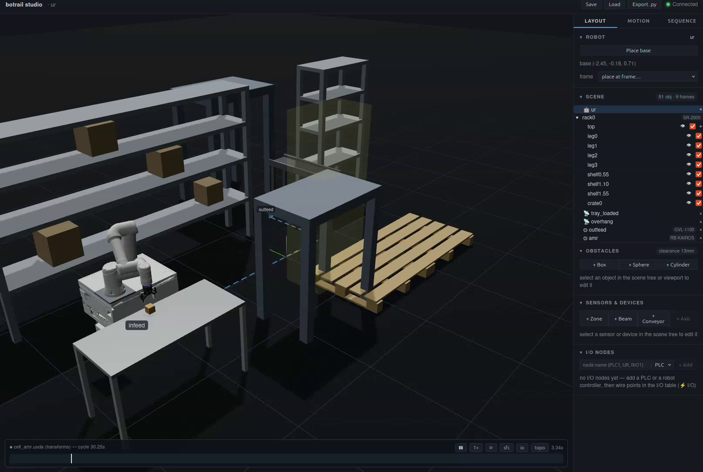
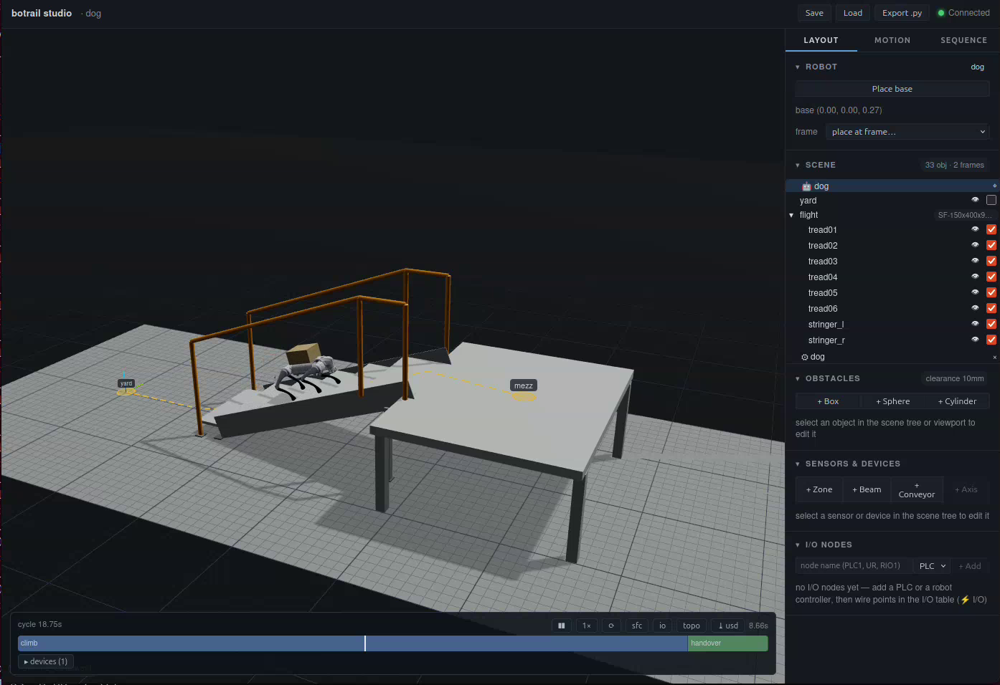
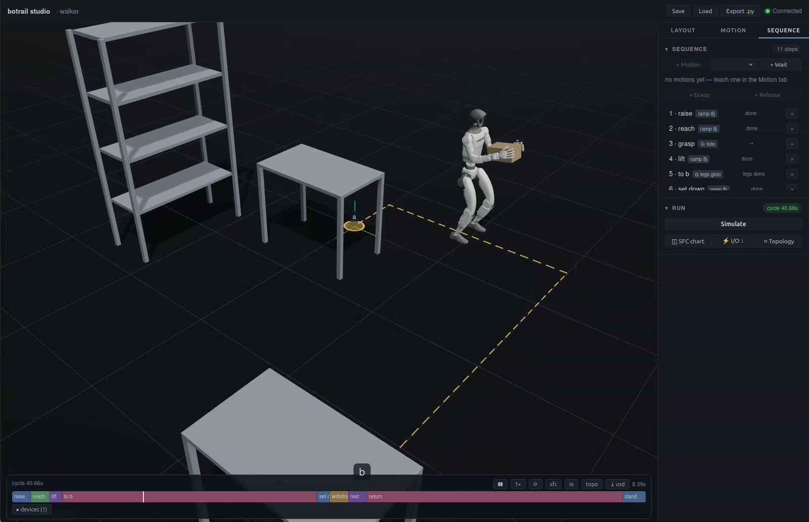
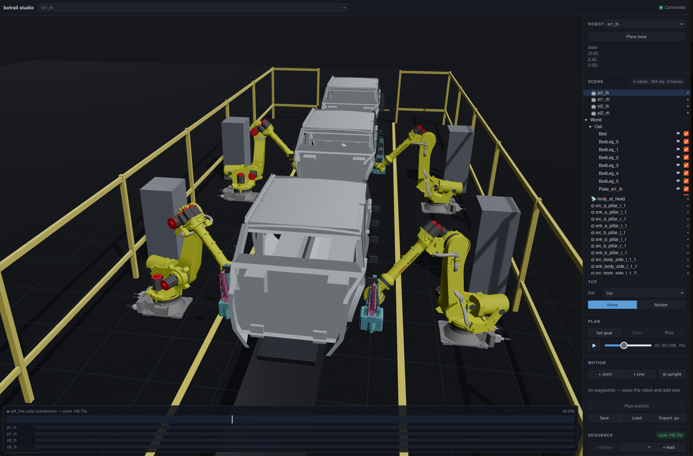

**Beyond motion planning. Build robot cells as code.**
*One source of truth from layout to I/O list — verified deterministically on every change.*

Documentation: https://botrail.github.io/botrail/ ·
Live Demo: https://botrail.github.io/botrail/demo/



<table>
  <tr>
    <td align="center" width="50%">
      <br/>
      <sub><b>Robot machining</b> — spindle toolpaths with stepwise stock removal</sub>
    </td>
    <td align="center" width="50%">
      <br/>
      <sub><b>Mobile manipulation</b> — an arm riding a catalog AMR between stations</sub>
    </td>
  </tr>
  <tr>
    <td align="center" width="50%">
      <br/>
      <sub><b>Legged mobility</b> — a quadruped climbs a catalog stair flight, payload on board</sub>
    </td>
    <td align="center" width="50%">
      <br/>
      <sub><b>Humanoid pick-and-carry</b> — walking is just another sequence step</sub>
    </td>
  </tr>
  <tr>
    <td align="center" colspan="2">
      <br/>
      <sub><b>Multi-robot weld line</b> — four stations, one deterministic timeline</sub>
    </td>
  </tr>
</table>

`pip install botrail`, a few lines of Python, and you get an interactive 3D
studio in your browser for building robot cells — robots, obstacles,
conveyors, sensors, and PLC-style sequences. The core is written in Rust —
no ROS, no system dependencies, no GPU.

A cell in botrail is text (Python / `.botrail` JSON / USD): it diffs in git,
it bakes into a bit-identical timeline every run, and it regression-tests in
CI. Motions are *planned*, not taught point by point, so moving a pallet or
a sensor doesn't break the cell — re-simulate and read the new cycle time.

## Highlights

- **Robots from URDF, Xacro, or USD** — including Isaac Sim articulations
  (`bt.Robot.from_usd("franka.usd")`), rendered at full visual fidelity
  with [three-usd-robot](https://github.com/neka-nat/three-usd-robot).
  Mimic joints (URDF `<mimic>`, USD `PhysxMimicJointAPI`) are followed, so
  a two-finger gripper costs one DOF, not two. Multiple robots per cell,
  with tick-checked inter-robot collisions and zone interlocks.
- **USD scene import** (usda/usdc/usdz, references, variants, instancing) —
  stages become obstacles and named mount frames, normalized to meters / Z-up.
- **Environments that behave** — a PLC-style step sequencer (entry actions +
  transition conditions on a fixed scan cycle), zone/beam sensors, conveyors
  and linear axes, and conveyor *tracking*: taught poses ride the moving
  part, so the belt never stops for the pick.
- **Deterministic bake** — `simulate_sequence()` turns Scene + Sequence into
  a bit-identical `SequenceTimeline`: cycle time, step spans, signal
  waveforms, object tracks.
- **Assertable timelines** — `step_span()` / `signal()` / `min_clearance()`
  turn a bake into pytest-able cell checks (cycle budgets, sensor timing,
  safety margins) that run in CI.
- **Open deliverables** — USD animation (plays in usdview / Omniverse /
  Blender), CSV/JSON, robot programs (URScript), Python code generation —
  and Isaac Sim recordings play back through the same pipeline.
- **Engineering documents, derived** — bill of materials, plan-view layout
  sheet (SVG / DXF), I/O list and controller topology, and a cell report
  (cycle times, clearance, I/O counts, scenario matrix, footprint, file
  digests) all come out of the same script as the simulation, so a layout
  edit changes exactly the documents it touches — and never lets them
  disagree.
- **Selection, checked — not chosen** — `scene.requirements()` derives what
  every BOM line must be able to do (payload from the grasped parts, reach
  from the taught targets, a beam's span, a conveyor's load...) and compares
  it with what the chosen part says; `bt.catalog.search` finds real products
  that satisfy it. A part that falls short is an error, a part that does not
  say is a warning, a line nobody has identified becomes the question to ask
  a vendor.
- **Interactive posing** — draggable TCP gizmo with live IK, joint sliders.
- **Collision checking** — primitives and STL/OBJ meshes (cached VHACD convex
  decomposition), live highlighting, clearance readout.
- **Motion planning & authoring** — RRT-Connect with time parameterization,
  waypoint motions with Cartesian-line segments and path constraints,
  trajectory playback in the studio.
- **Portable projects** — save/load `.botrail` files (meshes and USD stages
  bundled), regenerate any scene as a Python script.
- **Runs entirely in the browser** — the wasm build serves the full studio as
  a static page, no server; drop a USD file straight into the viewport.

## Try it

Run the bundled demos — a Franka Panda in a small USD factory cell whose
belt, rack and guarding are ordered from the model catalog (the first run
downloads NVIDIA's official Franka asset, ~10 MB, and the catalog packages;
`pip install botrail[catalog]` for those):

```bash
python examples/basics/demo.py           # interactive studio: pose, plan, play
python examples/basics/sequence_demo.py  # 13-step cell: conveyor feed → tracked pick
                                  # → pallet; prints the cycle time, exports USD
python examples/multi_robot/dual_cell_demo.py # two arms sharing one infeed, arbitrated by a
                                  # zone interlock; --clash shows what happens
                                  # without it
python examples/basics/sweep_demo.py     # parameter sweep: belt speed × lane position
                                  # vs cycle time and clearance (no downloads)
python examples/engineering/cell_deliverables_demo.py  # the whole document set from one
                                  # script: layout SVG/DXF, BOM, I/O list, robot
                                  # program, USD, cell report (no downloads)
python examples/engineering/equipment_cell_demo.py     # fence, conveyor and rack ordered from
                                  # the catalog: a bill with real part numbers,
                                  # and each drawn from the package's own file
python examples/export/play_record.py \
       cell_dual.usda             # replay a baked USD in the studio (any of
                                  # the recordings above; omit for cell_seq)
```

Or try the browser-only build ([deployed from `main`][demo], or build it
locally):

[demo]: https://botrail.github.io/botrail/demo/

```bash
./scripts/build_wasm_demo.sh          # needs wasm-pack + wasm32 target
python -m http.server -d studio/dist-wasm 8899
```

## Quickstart

```python
import botrail as bt

robot = bt.Robot.from_urdf("robot.urdf")   # or from_xacro(...) / from_usd(...)
scene = bt.Scene(robot)

scene.load_usd("cell.usda", prefix="env")                # obstacles + frames
scene.set_robot_base_pose(*scene.frame("env/World/mount"))
scene.add_box("table", size=(0.6, 0.6, 0.05), position=(0.4, 0.0, 0.0))

bt.studio(scene)  # opens the 3D studio in your browser
```

Everything you do in the studio is mirrored in Python, and vice versa:

```python
scene.set_tcp_target((0.3, 0.1, 0.5))         # live IK, pushed to the browser
scene.in_collision()                          # False
scene.min_obstacle_distance()                 # clearance in meters

traj = scene.plan_to_pose((0.4, 0.1, 0.3))    # IK, then RRT-Connect + time param
traj.export_csv("motion.csv", dt=0.008)

scene.save_project("cell.botrail")            # meshes/USD bundled when needed
print(scene.generate_python())                # script reproducing the scene
```

## Verify the cell, not just the trajectory

Give the environment behavior, write the process as steps, and bake:

```python
scene.add_box("crate", size=(0.04, 0.04, 0.04), position=(-0.5, 0.6, 0.3))
scene.add_conveyor("belt", zone_position=(-0.2, 0.6, 0.3),
                   zone_size=(1.2, 0.3, 0.3), velocity=(0.25, 0.0, 0.0),
                   running=False)
scene.add_beam_sensor("eye", frm=(0.0, 0.4, 0.3), to=(0.0, 0.8, 0.3))
scene.add_segment("approach", goal=[0.6, -0.5, 0.8, 0.0, 0.4, 0.0])

sq = scene.sequence("cycle")
sq.step("feed", actions=[bt.seq.start("belt")], transition=bt.seq.signal("eye"))
sq.step("stop", actions=[bt.seq.stop("belt")])
sq.step("pick", actions=[bt.seq.motion("approach")])

tl = scene.simulate_sequence("cycle")   # deterministic: bit-identical every run
print(tl.duration)                      # cycle time in seconds
tl.export_usd("cycle.usda", fps=60)     # replay in usdview / Omniverse / Blender
```

Because the bake is deterministic, the same numbers are regression tests —
the workflow botrail exists for:

```python
def test_cell_cycle():
    tl = build_cell().simulate_sequence("cycle")
    assert tl.duration <= 8.0                # cycle-time budget
    assert tl.step_span("feed").end <= 2.0   # the crate arrives on time
    assert tl.signal("eye").rising_edges()   # the handshake happened
    assert tl.min_clearance() > 0.05         # closest approach, meters
```

Move the beam sensor 0.25 m downstream and the cycle grows by exactly
1.0 s — a layout edit becomes a failing test instead of a shop-floor
surprise. This repository runs such a cell in its own CI
([python/tests/test_cell_regression.py](python/tests/test_cell_regression.py)),
and [examples/basics/sweep_demo.py](examples/basics/sweep_demo.py) runs the same loop as a
parameter study — `bt.sweep` bakes the cell over a grid and tables it (belt
speed moves the cycle; lane position eats the clearance), `bt.optimize`
searches the grid for the fastest cycle that keeps its clearance — with no
random number anywhere.

## Hand over the cell

The documents a cell is delivered as come out of the same script — none of
them is typed in beside the model:

```python
scene.set_part("belt", manufacturer="MISUMI", model="GVL-1200")   # what things *are*
scene.export_bom("bom.csv")               # bill of materials, merged and counted
scene.export_layout("layout.dxf")         # plan-view sheet for the 2D CAD (.svg for the review)
scene.export_io_list("io.csv")            # I/O list for the electrical drawing
tl.export_script("cell.script")           # the robot program, with the same DI/DO numbers

report = scene.cell_report({"cycle": tl}, deliverables=["bom.csv", "layout.dxf", "io.csv"])
report.save("cell_report.md")             # cycle time, clearance, I/O, BOM totals,
                                          # footprint — and the SHA-256 of each file
```

Because they are derived, they cannot disagree with each other or with the
bake, and a layout edit changes exactly the documents it touches:
[examples/engineering/cell_deliverables_demo.py](examples/engineering/cell_deliverables_demo.py)
writes the whole set, and
[python/tests/test_deliverables.py](python/tests/test_deliverables.py) pins
which files a moved sensor or an added fence panel changes — by name.

The same loop runs without writing Python — the entry an agent's iteration
and a CI job share:

```bash
botrail check cell.py                                  # load, lint, count → JSON (exit 1 on errors)
botrail simulate cell.py --scenarios --report r.json   # bake the matrix → the cell report
botrail export cell.py --out deliverables/ --all       # the whole document set, hashed into the report
botrail schema > project.schema.json                   # the .botrail JSON Schema, from the Rust types
```

## Development

Requirements: Rust (stable), Python >= 3.9, [maturin](https://maturin.rs),
[uv](https://docs.astral.sh/uv/), Node 20+ with pnpm.

```bash
./scripts/build_studio.sh                 # build the studio UI into the package
uv venv .venv && source .venv/bin/activate
maturin develop --uv
python examples/basics/demo.py
```

Tests:

```bash
cargo test                                # Rust workspace
python -m pytest python/tests             # Python bindings
```

Docs (mkdocs, published at the link above):

```bash
uv pip install --group docs
mkdocs serve                              # needs `maturin develop` first
```

Contributor notes are in the
[Contributing](https://botrail.github.io/botrail/contributing/) page.

## License

botrail 0.6.0 and later is source-available under your choice of the
[PolyForm Small Business License 1.0.0](https://polyformproject.org/licenses/small-business/1.0.0)
or the
[PolyForm Noncommercial License 1.0.0](https://polyformproject.org/licenses/noncommercial/1.0.0).
Use not permitted by either license requires a separate commercial license from
[UnRobotics Inc.](https://www.un-robotics.com/#contact).

See the [license notice](LICENSE), [included license texts](LICENSES/),
[commercial licensing information](COMMERCIAL-LICENSE.md), and
[licensing FAQ](docs/license.md). Versions v0.5.0 and earlier remain under the
MIT License terms shipped with those releases.

Redistributions must preserve these notices:

Required Notice: Copyright (c) 2026 k-tanaka and botrail contributors.

Required Notice: botrail is licensed by UnRobotics Inc. (https://www.un-robotics.com/).
