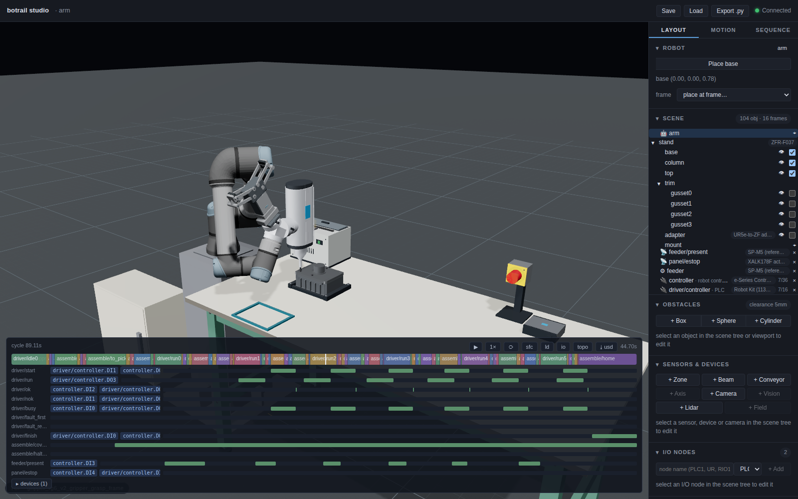

# Assembly and fastening

A cobot fits a cover over its dowels and screws it down — the cell every
screwdriving-tool vendor shows. botrail says it in the vocabulary it
already has: a fit is an `attach`, a move and a `detach`; a fastening is
that same carry for the screw and then the screwdriver's own stroke
running it down at the thread's feed, while the **driver's program** —
one more PLC program scanned beside the robot's — times the rundown from
the screw's pitch and answers OK or NOK. Threads, torque curves and
cam-out are not simulated: the numbers are data with a source, the
motion is geometry, the result is a signal.

```python
import botrail as bt
A = bt.assembly

screw = A.iso4762(5, 20)                                   # M5×20, class 8.8
threads = A.BoltPattern([A.Hole(f"h{i}", xy, "threaded", depth_mm=13) for i, xy in enumerate(HOLES)])
clearances = A.BoltPattern([A.Hole(f"h{i}", xy, "clearance", 5.5, grip_mm=10) for i, xy in enumerate(HOLES)])
joint = A.joint(scene, "cover_joint", a="set/housing", b="set/cover",
                pattern_a=threads, pattern_b=clearances, fastener=screw,
                seat=((hx, hy, top), (0, 0, 0, 1)), thickness=0.010,
                torque_nm=(4.0, 5.0), min_engagement_mm=10)
driver = A.driver(scene, "driver", robot="arm", bit="drv_bit", shank="drv_shank", stroke=0.055,
                  fastener=screw, torque_nm=4.5, cycles=len(joint.order) + 1)
sq = scene.sequence("assemble")
fastening = A.fasten(sq, joint, driver, feeder, motions={...})
tl = scene.simulate_sequences(["assemble", driver.program])
rows = A.fastening_report(tl, fastening)
```



The worked example is
[`examples/assembly/cover_bolting_demo.py`](https://github.com/neka-nat/botrail/blob/main/examples/assembly/cover_bolting_demo.py):
a UR5e on a catalog robot stand with an OnRobot RG6 and Screwdriver 103961
on a Dual Quick Changer v3, a screw presenter at its elbow, and a gear housing whose cover
takes six M5 screws in a star pattern.

## The joint as a drawing states it

[`bt.assembly.joint`][botrail.assembly.joint] declares what a drawing
does: the **threaded** holes of one part (their usable depth, an
unthreaded lead), the **clearance** holes of the other (the grip under
the head), the **locators** (dowels and their holes), the **screw**
([`Fastener`][botrail.assembly.Fastener] — [`iso4762`][botrail.assembly.iso4762]
tables the socket head cap screws M3–M12), the **torque** the joint is
designed for and the **engagement** it needs. From that it derives what
the cell uses:

* one frame per hole, `<joint>/hole/<id>`, on the cover's top face, +Z
  out — a screw is driven by aiming the tool tip's +Z along it, the way
  a spindle's tip aims along a toolpath; `<joint>/seat` where the cover's
  underside lands;
* the tightening **order** ([`star_order`][botrail.assembly.star_order]):
  opposite pairs through the centroid, the innermost first — the middle
  pair of a rectangular cover, then its diagonals; 1, 5, 3, 7, 2, 6, 4, 8
  on a ring, as flange practice (ASME PCC-1) has it;
* the **engagement** (length − grip − washer − thread start) and the
  tip's depth against the hole's bottom.

A joint the screw cannot make is refused when it is declared, with the
numbers: an M5×16 through a 10 mm cover engages 6 mm where the joint
asks 10. The reference torque for a class at μ = 0.14 (ISO 898-1, the
usual VDI 2230 figures) is carried as a *ceiling*; the joint's own value
is what a tapped aluminium housing is tightened to.

## The driver's program

[`bt.assembly.driver`][botrail.assembly.driver] authors the screwdriver's
controller as a program of its own — the way a machine tool's is in
[machine tending](machine-tending.md). On `driver/start` it finds the
drive, **runs the screw down at its rpm for exactly the time the thread
takes** (length plus the approach gap, at pitch × rpm), pre-tightens,
final-tightens a third of a turn at 40 rpm, then answers `driver/ok` or
`driver/nok` and holds `busy` until the start drops. `driver/run` is on
while the bit turns — what the studio's spin effect binds to. With an
E-stop lane no run is admitted while it is pressed, which is the
interlock table's row.

The result is OK unless a scenario says otherwise: `driver/fault_first`
fails the next run, `driver/fault_retry` the one after — the two faults
a fastening's retry branch is tested with. The program is as many
rundowns as starts it may serve (`cycles`), nested so it ends on
`driver/finish` — a signal the robot's program raises when it is done —
from whichever cycle it is waiting in.

The driver's datasheet figures (`tool={"torque_nm": (0.15, 5.0),
"screw_length_mm": 50, "bit_mm": 4}`) are what
[`check`][botrail.assembly.check] compares the joint against: an M6
class 8.8 joint at its 10.5 N·m table torque is more than a 5 N·m cobot
screwdriver delivers, and the check says so before anything is taught.

## The hand and the presenter

The demo uses dimensioned reference geometry for the OnRobot Screwdriver
103961 and Dual Quick Changer v3 109878, with a catalog RG6. The driver
is supported at its side; a Type A 50 mm bit extender clears the cover's
bearing boss. Both tools stay attached and the robot selects one by
turning its wrist. The [product notes](https://github.com/neka-nat/botrail/blob/main/examples/assembly/cover_bolting_demo.md)
record source drawings, the required Compute Box route and unverified
hardware loads.

Like the generic [`bt.tools.screwdriver`][botrail.tools.screwdriver],
the reference tool has a prismatic `shank`: its own feed advances the
screw while the arm stands still. Its `tip` has +Z pointing back along
the tool, the axis convention every process tool follows. The gripper stays the TCP; the bit's tip is
what screw poses are taught for (`link=`). Only the `bit` is allowed to
touch a screw (`allow_link_obstacle_contact`), and the screw a bit
carries is attached to it. `scene.add_spin("driver/spin", driver.signal("run"), "arm", link="drv_bit")`
turns the bit in the studio while the driver's `run` lane is on — a
presentation effect, like a weld flash, that draws nothing else.

[`bt.parts.screw_feeder`][botrail.parts.screw_feeder] is a screw
presenter: a box with a magazine row inside and a pick point on its top
face. It is an indexing `Source` — each `bt.seq.start("feeder")` puts
the next screw on the pick point, exactly one per request — with a zone
sensor `feeder/present` over the point, on while a screw stands there
and off when the bit lifts it away. The screws themselves are
[`bt.parts.bolt`][botrail.parts.bolt] obstacles — a shank with its tip
at the origin and a head on top, one obstacle each (a magazine of one
screw lands on the bill as one line with a count), made with
[`Fastener.place`][botrail.assembly.Fastener.place] from the standard's
figures. [`bt.parts.compound`][botrail.parts.compound] makes such a
one-obstacle shape from several primitives — a cover plate with its
bearing boss is another.

## The program

[`bt.assembly.place`][botrail.assembly.place] appends the fit: the
taught approach, the descent, the gripper's close (a
[`grasp_close`](attach-and-tracking.md) derived from the mesh), the
attach, the carry, the seat, the release.
[`bt.assembly.fasten`][botrail.assembly.fasten] appends the screws, one
per hole in the joint's order: request a screw, pick it (the bit a
millimetre into the socket), carry it over its hole, engage (the tip a
gap above the face), raise `start`, ramp the shank down the screw's
length in the thread's time while the driver runs, wait for OK. On NOK
the shank backs out and the run is repeated up to `retry` times; a last
NOK releases the screw where it stands, raises `<program>/halted` and
stops the program there — the refused cycle a FAT row wants. The taught
motions are named per screw (`"screw_over_{hole}"`), so a teach loop
over `joint.order` is all the demo writes.

## What the bake says

[`fastening_report`][botrail.assembly.fastening_report] is one row per
screw, facts then checks, in `grasp_report`'s form: how far off its
hole's axis the screw engaged and at what tilt, how far it went down,
how long the drive took, how many attempts and the result — and the
figures no bake changes, the engagement and the tip depth and the torque
against the joint's. [`fit_report`][botrail.assembly.fit_report] says
where the cover landed against its seat.

## Handing over

The document set is the one every cell gets ([hand over the
cell](../tutorials/hand-over.md)) with three pages the joint adds.

**The tightening sheet.** [`export_sheet`][botrail.assembly.export_sheet]
writes one line per screw in the order it is driven: hole, screw,
thread, length, class, head, engagement, torque, the rundown time and
the step that runs it — with the baked result columns (offset, seat,
drive time, attempts, result) when given the report, the driver's
timing per screw, and how many screws were driven. Markdown for the
review, CSV for the torque-tool's setup.

**The interlock table.** Two guards a reviewer looks for are written
into the program rather than assumed. `place` raises
`<program>/<part>_seated` when it lets the part go, and
`fasten(after=[placement.seated])` picks the first screw only once that
signal and the presenter's `present` are both on; and while the driver
has an E-stop lane, the engage move completes — and `start` is raised —
only with it released. On the table
([`Scene.interlocks`][botrail.Scene.interlocks]) they read:

```text
| to_pick0 | (feeder/present AND assemble/cover_seated) | motion screw_to_pick (arm) |
| start0   | (DONE(screw_engage_h5) AND NOT panel/estop) | driver/start := TRUE |
```

and the driver's own gate, `driver/start AND NOT panel/estop`, is the
row below them.

**The report's assembly section.**
[`report_section`][botrail.assembly.report_section] turns the joint,
the driver's timing, the fit and the fastening rows into a section the
cell report carries (`scene.cell_report(..., sections=[...])`) — as
Markdown under its own heading and as JSON under `sections`, so a
regression test reads `report.sections[0]["json"]["screws"]` the way it
reads `report.footprint`.

**The FAT rows.** Each fault is a scenario, and each run must refuse the
cycle rather than let it through:

| scenario | what is injected | where the run stalls |
| --- | --- | --- |
| `nok_once` | the driver answers NOK once | passes — the retry drives it |
| `nok_twice` | NOK twice | `halt0`: the screw released where it stands, `assemble/halted` up |
| `estop_pressed` | `bt.io.stuck(estop, True)` | `engage0`: no start raised, the driver at `idle0` |
| `feeder_empty` | the screws moved out of the magazine | `feed0`: no `present`, the arm waits |
| `start_wire_open` | `bt.io.open(driver.signal("start"))` | `run0`: the arm raised it, the driver never heard it |

The bill carries the six screws as one line, the I/O list the
handshake as wires between the arm's controller and the driver's, the
PLCopen export the driver's program on a resource of its own.

## Ordering from the catalog

`--catalog` on the demo takes the presenter, screws and workpiece set
from their packs, with the joint dimensions read from the workpiece.
The OnRobot tooling uses the same commercial product references in both
modes; its changer and driver geometry are authored from public drawings.

```python
work = bt.parts.workpiece(scene, "set", (hx, hy, bz), catalog="botrail/workpiece/gear-cover-set/r1",
                          cover_at=(sx, sy, bz))                        # housing, dowels, cover
screw = A.Fastener.from_catalog("botrail/fastener/iso4762-m5/r1", length_mm=20)
joint = A.joint(scene, "cover_joint", a=work.housing, b=work.cover, seat=work.seat,
                catalog="botrail/workpiece/gear-cover-set/r1", fastener=screw)
feeder = bt.parts.screw_feeder(scene, "feeder", (fx, fy, bz), screws=len(joint.order),
                               fastener=screw, catalog="botrail/feeder/screw-presenter-m2-m6/r1")
```

A **workpiece set** is a spec pack whose `mounting` declares the joint
in the vocabulary tool mountings use — the housing's top face as the
`flange` side with its threaded holes and dowel pins, the cover's
underside as the `mount` side with its clearance holes, the `fasteners`
with the joint's torque and the engagement rule —
[`bt.parts.workpiece`][botrail.parts.workpiece] stands the parts from it
(the pins where the flange face's locators say) and
[`joint(catalog=...)`][botrail.assembly.joint] reads the holes, the
screw, the torque range, the engagement and the thickness from the same
declaration. A **fastener** pack sells lengths and property classes;
[`Fastener.from_catalog`][botrail.assembly.Fastener.from_catalog] carries
its article number, mass and the class's reference torque, and every
screw placed from it lands on the bill under that number. A
**presenter** pack sells rail sizes; the feeder takes its body, pick
point and `present_s` from it and can fill its own magazine
(`screws=6`). The **screwdriver** carries its manufacturer's model,
part number and specifications through `set_part` (`tool.screwdriver`:
torque range, thread range, screw length, stroke, bit). Mount it with
`attach_tool` before the gripper, since the last tool's declared TCP is
the assembled hand's default TCP.

What the packs add to the check: the screws carry their joint's torque
on the bill once `fasten` declares it, and
[`scene.requirements()`](selection.md) derives what the screwdriver line
must deliver — `torque_nm`, `screw_length_mm`, `thread_max_mm` /
`thread_min_mm` — against its declared specifications. An M6 class 8.8 joint at
its 10.5 N·m table torque comes out `short` on a 5 N·m cobot
screwdriver; the M5 joint at 4.5 N·m comes out `ok`.

## Fitting is a contact the check knows about

A part being fitted meets what it is fitted into — the cover rests on
the housing and its dowels, the screw goes *into* the cover and the
housing — and without a word the collision check would refuse every one
of these. [`Scene.allow_object_obstacle_contact`][botrail.Scene.allow_object_obstacle_contact]
is that word, the carried-object counterpart of
`allow_link_obstacle_contact`: while the object is attached it may meet
the named obstacle — anywhere (`place(..., touch=[...])` declares the
housing and the dowels for the cover), or only **within a window**: the
carried object's origin within a radius of a line, its own +Z within an
angle of it. `fasten` declares one window per screw, the hole's axis and
the hole's `tolerance_mm`, for both parts of the joint. So the engage
move — a collision-checked straight line that puts the screw's tip a few
millimetres into the hole — passes on the hole and is refused 2 mm off
it, by name (`screw5 x set/cover`); and the clearance measure over the
cycle names what the cell really came closest to, not a screw in its
hole. Like every allowance, toolpath rapids ignore it. The allowance is
the scene's, saved in the project and written by the Python export.

## What is not simulated

Threads are not contact: the rundown after the engage move is the tool's
own stroke, a ramp, which the collision check does not read — as it does
not read a gripper's close. The report says how far the screw went down;
the joint's figures say whether it engages. Torque curves, cam-out,
cross-threading and the presenter's mechanics are data and signals, not
physics.
