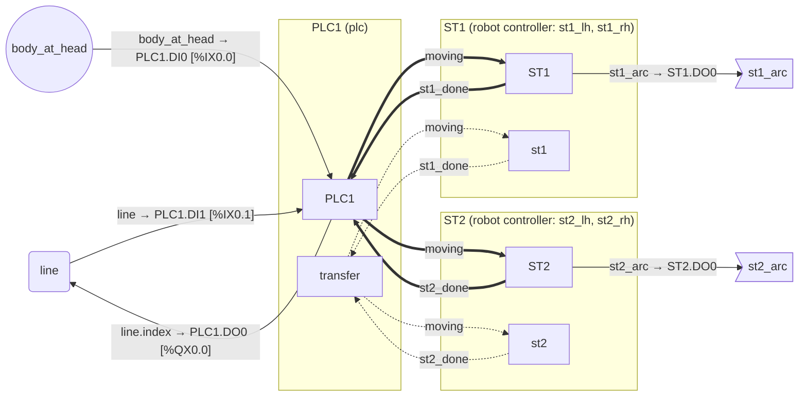
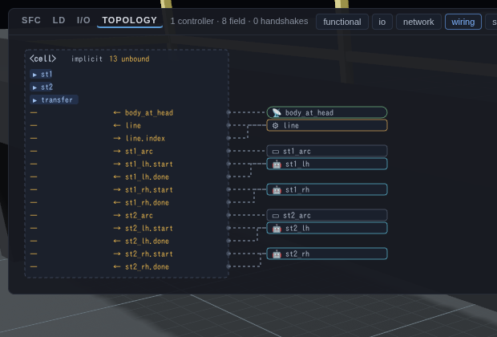
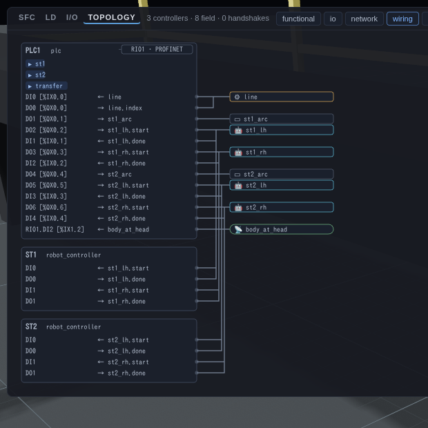
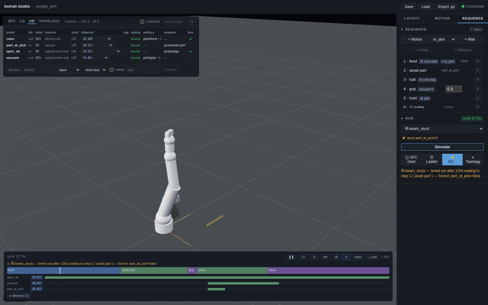

# The I/O map

A cell that bakes is not yet a cell that can be built. Between the two sits
the electrical face of the cell — which signals become which inputs and
outputs on which controller, how many points that is, and where the
handshakes run. botrail derives that list from the cell you already
authored; there is nothing extra to write.

```python
scene.io_points()                  # the points, one per wire the cell needs
scene.io_report()                  # findings: unbound points, clashes, ...
scene.export_io_list("cell_io.csv")   # .csv / .md / .json
scene.auto_assign_io()             # put every unbound point on a free channel
scene.export_topology("cell.mmd")  # who wires to whom — .mmd / .dot / .json
```

The points are **derived, not stored**: call again after any edit and the
list follows. What it derives is decided by how the sequences use the
scene's names — the same rule that gives a PLC its I/O list from its
ladder. What *is* stored is the assignment layer: which controller runs
which program, and which channel each point lands on (see
[Nodes and bindings](#nodes-and-bindings) below).

## How points are derived

| The cell says | The map lists | Rule |
|---|---|---|
| a `Zone` / `Beam` sensor | a **DI** on every host that reads it (or one unhosted DI if nobody does — the sensor still exists) | ① |
| an internal signal that one program `set`s and another program **on a different controller** reads | a **handshake wire**: a DO on the writer's host, a DI on each other reader's host (one output fanning out to N inputs) | ② |
| an internal signal written and read on **one** controller | an *internal* relay — listed, but not I/O | ② |
| an internal signal that is only ever `set` | a **DO candidate** — an actuator coil (`vacuum`, `gun_on`, `spindle_run`) or a state flag; you decide which by binding it or not | ③ |
| an internal signal that is only ever read | a **DI candidate** — an external contact (a gauge verdict, a selector switch, an E-stop healthy signal) | ④ |
| a device commanded `start`/`stop` | a **DO** run coil; `advance` → `name.index` DO; `goto` → `name.dispatch` DO + `name.station` Word; `move_to` → `name.position` Word; `set_speed` → `name.speed` AO | ⑤ |
| a device awaited with `device_done` | a **DI** (in position / arrived) | ⑤ |
| a linear axis with named `stops` | a **DI** per stop, `<axis>/<stop>` — the limit switch at that end, read like a sensor | ⑤ |
| a `Source` / `Sink` magazine | a *cosmetic* row — presentation, not counted, not linted | ⑤ |
| a robot driven (`motion` / `ramp` / `toolpath`) by a program that does **not** live on that robot's own controller | `robot.start` DO + `robot.done` DI on the driving host; a `robot.program` Word when the program picks among several motions | ⑥ |
| a program that only reads `robot_done("x")` from another host | `x.done` DI on the reader's host | ⑥ |

Word and AO points are table vocabulary — the numeric commands a bool coil
cannot carry. They are listed (and flagged `word_unexpressible`, an info),
and the URScript lowering keeps them as comments, as it does today.

## Hosts: who owns a point

Every point belongs to a *host*, the controller that owns it. Until a node
declares one (`programs=`, below), hosts are implicit and follow the same
rule the URScript export uses:

* a program that drives **exactly one robot** lives on that robot's own
  controller — shown as `<robot name>`;
* a program that drives **none or several** lives on the implicit cell
  controller — shown as `<cell>` (an `implicit_host` info names it).

That is why the single-arm demos show no robot handshake at all (the robot
runs its own program, like the URScript it exports), while a two-arm program
grows `near.start` / `near.done` / `far.start` / `far.done` on `<cell>` — the
PLC-master view of the same cell, with nothing declared. Reader hosts split
points: a signal read from two controllers is two inputs and one wire.

Declaring nodes (`programs=`) moves programs between hosts, and binding
points to channels is what turns the list into wiring — the next section.

## Nodes and bindings

The assignment layer has three parts, all stored on the scene and in the
`.botrail` project:

```python
# controllers and I/O stations — the boxes
scene.add_io_node("PLC1", kind="plc", programs=["transfer"],
                  channels=bt.io.di16(base="%IX0.0") + bt.io.do16(base="%QX0.0"))
scene.add_io_node("RIO1", kind="remote_io", uplink=("PLC1", "PROFINET"),
                  channels=bt.io.di8(base="%IX1.0"), model="ET200SP", place="panel")
scene.add_io_node("UR", kind="robot_controller", robots=["arm"],
                  channels=bt.io.ur_standard())

# point → channel — one wire per controller
scene.bind_input("beam_pick", "RIO1", "DI2", tag="PartAtPick", field="-B1")
scene.bind_output("conv", "PLC1", "DO0", tag="BeltRun", field="VFD1")
scene.bind_output("vacuum", "UR", "DO1", field="YV1", invert=True)   # NC wiring
scene.bind_input("far.done", "PLC1", "DI4")                          # a robot's done contact

# exceptions to the derivation, and unmodelled points
scene.declare_io("spec_ok", role="internal")                         # a constant, not a contact
scene.declare_io("door_ch1", role="input", kind="safe_di", safety=True, pair="door_ch2")
```

* **Nodes** are `plc`, `safety_plc`, `remote_io`, `robot_controller`
  (with `robots=[...]` — a two-arm cabinet lists both) or `other`
  (documentation only). `programs=` places sequences on a node and
  overrides the implicit hosting; `uplink=` hangs a remote station or a
  safety module off a controller — its channels then take that
  controller's points. `channels=` is a list of dicts; the `bt.io`
  templates build them (`di8/do8/di16/do16(base=…)`, `safe_di8`, `word`,
  `ao`, `ur_standard()`), a catalog product brings its own
  (`bt.io.from_catalog("universal_robots/ur/ur5e/r1")` reads the package's
  `electrical.io` — the controller's channel table, or the template it
  names; `bt.parts.remote_io(catalog=…)` builds a station's node the same
  way), and address dialects live there, in Python:
  `base="%IX0.0"` counts byte.bit (IEC; Siemens `I0.0` / `Q0.0` the same
  way, `bt.io.siemens("di", 16)`), `bt.io.melsec("di", 16, "X10")` counts
  hex for the Q / iQ-R series (`octal=True` for FX: `X10 … X17, X20`),
  `bt.io.logix("di", 16)` a flat Logix bit index (`Local:1:I.Data.0 …
  .15`), and `bt.io.address(base, n, radix, word_bits)` is the counter
  behind them all.
* **Bindings** key on `(point, node)`. `name` is the point's label —
  `"conv"`, `"line.index"`, `"far.done"`. `invert` is the wire polarity:
  the bake is untouched, the URScript export tests and writes the
  opposite level. `contact` (`"no"`/`"nc"`), `field`, `voltage`, `logic`
  (`"pnp"`/`"npn"`), `note` document the far end.
* **Declarations** override the derivation for one name — `"input"`,
  `"output"` (also promotes a magazine to a real feeder), `"internal"`,
  `"exclude"` — and add unmodelled points (a safety door's two channels)
  that exist on the drawing but not in the simulation.

Once nodes exist, the derivation places programs on them (a program that
drives a robot whose controller is a declared node lives there), matches
bindings to points, and the report gains the assignment lints:

| code | severity | meaning |
|---|---|---|
| `unbound` | error / warning / info | a point without a channel: error for sensors the sequences read, run coils, in-position inputs, robot start/done, handshake wires; warning for candidates (write-only / read-only signals, unread sensors); info for Word/AO |
| `duplicate` | error | two points on one channel; two channels of a node with the same address or tag |
| `kind` | error | an input bound to a DO channel, a word to a DI, ... |
| `host_mismatch` | error | a binding on a node that does not reach the point's host (bind it there, or uplink the node) |
| `stale_binding` | warning | a binding whose point is no longer derived — the sequences stopped using the name that way |
| `unknown_ref` | error | a node listing a program that is not a sequence, a robot not in the scene, an uplink to nothing; a declaration naming nothing |
| `program_multihost` | error | one program listed by two nodes |

Before any node is declared nothing is being assigned, so `unbound` stays
quiet — the I0 lists of the shipped demos are clean. `assert
scene.io_report().errors() == []` is the CI form once the wiring is meant
to be complete.

### Scripts follow the bindings

`to_script` / `export_script` (on a timeline or a scenario sweep) project
the bindings on the robot-controller node onto the script's digital ports
— `channel.port` is the vendor number `set_standard_digital_out(...)`
takes — so the `inputs=` / `outputs=` dicts become optional. Explicit
dicts still win, per key; `node=` picks another node; `io=scene.io_map()`
projects the scene's *current* assignment onto a timeline baked before
you wired it (a timeline carries the scene as it was when it baked).

Two things changed under the hood: an inverted binding inverts every
test and write of that point in the script, and a program's `robot_done`
on its **own** robot lowers to nothing — a blocking controller is idle
there by construction, so it needs no input port any more.

## The program set

The walk covers every sequence in the scene by default. A scene that keeps
alternative programs side by side (the two-arm demo has `dual_pick` and an
interlock-free `clash`) reads differently per set, so name the programs you
would pass to `simulate_sequences`:

```python
scene.io_points(sequences=["dual_pick"])
scene.export_io_list("io.csv", sequences=["dual_pick"])
```

## Reading a point

```python
for p in scene.io_points():
    print(p.label, p.direction, p.kind, p.source, p.host, p.status)
```

* `label` — `name` or `name.aspect` (`line.index`, `agv.station`, `far.done`).
* `direction` — `"input"` / `"output"`, from the host's side.
* `kind` — `"DI"`, `"DO"`, `"Word"`, `"AO"`, ...
* `source` — the rule that produced it: `sensor`, `signal:handshake`,
  `signal:internal`, `signal:write-only`, `signal:read-only`,
  `device:run`, `device:done`, `device:command`, `device:cosmetic`,
  `robot:start`, `robot:done`, `robot:program`.
* `writers` / `readers` — `(sequence, flat step index, step name)` of the
  steps that drive or wait on it (the same step keys the timing chart uses).
* `status` — `bound`, `unbound` (needs a channel), `internal`, `cosmetic`,
  or `constant` (a belt that runs from t = 0 and is never commanded: the
  drive exists, wired on).

## Findings

`scene.io_report()` returns findings with a severity, a code and the steps
they belong to. The derivation's own codes:

| code | severity | meaning |
|---|---|---|
| `name_clash` | warning | a name shared by two of signal / sensor / device / robot, or a signal name containing `.` (it reads like `name.aspect`) |
| `unreferenced` | info | a signal or device that no program touches |
| `word_unexpressible` | info | a Word / AO point — in the table, not on a bool channel |
| `implicit_host` | info | a program that landed on `<cell>` (drives none or several robots) |

```python
report = scene.io_report()
assert report.errors() == []          # the CI form (nothing errors yet — see below)
for f in report.warnings():
    print(f.code, f.message, f.at)
```

The assignment codes are listed under [Nodes and bindings](#nodes-and-bindings).
Once channels carry electrical data (`voltage`, `logic`) and points carry
safety, the report also checks the wire against the terminal:

| code | severity | meaning |
|---|---|---|
| `capacity` | warning | a host needs more channels of a kind than it (and its uplinked stations) has — `PLC1 needs 6 DI but has 4` — so `auto_assign_io` will leave points unbound |
| `polarity` | warning | a binding's `logic` (`pnp`/`npn`) differs from the channel's |
| `voltage` | warning | a binding's `voltage` differs from the channel's |
| `safety` | warning | a safety point on a standard channel, or a standard point on a safety channel |
| `safety_pair` | error | the two channels of a declared `pair=` sit on different nodes, or on channels of different kinds |
| `safety_unread` | warning | a declared safety input that no program reads — the E-stop that nothing waits for |
| `multiple_drivers` | error | one output written by two programs on the same host — the ownership rule, caught before a bake |

`multiple_drivers` reads over the program set (`sequences=`), so alternative
programs kept side by side do not trip it unless you ask for both.

## Automatic assignment

Once the nodes exist, `auto_assign_io()` binds every point that still lacks
a channel:

```python
report = scene.auto_assign_io()          # returns the report after assignment
assert report.errors() == []
scene.auto_assign_io(reassign=True)      # drop the automatic bindings and renumber
scene.auto_assign_io(sequences=["dual_pick"])
```

The walk is deterministic — points in table order (name, aspect, direction),
channels in the order the node lists them, hand-made bindings kept, a host's
own channels before its uplinked stations' (declaration order among those),
safety points to safety channels first — so two runs over the same cell give
the same table, and the export
after it (`export_io_list`, `to_script`) is reproducible. What does not fit
stays `unbound` and a `capacity` warning says by how much; a point without a
kind-compatible channel anywhere on the host stays unbound too. Bindings you
made by hand are never moved; `reassign=True` renumbers only the automatic
ones, or everything when you also unbind by hand first.

## The topology

The same derivation drawn as a graph — controllers as boxes, programs inside
them, sensors, devices and field terminals outside, and every wire between
them:

```python
scene.io_topology()                            # Mermaid text
scene.io_topology("dot", layers=["wiring"])    # Graphviz, one layer
scene.export_topology("cell.mmd")              # .mmd / .dot / .json
```

Five layers, any subset (`layers=[...]`), all by default:

| layer | shows |
|---|---|
| `functional` | program → program, one edge per signal — the SFC's view |
| `io` | point → channel: sensor → host, host → device / field terminal, labelled `point → node.channel [address]` |
| `network` | uplinks (remote I/O and safety stations hanging off a controller, labelled with the bus) |
| `wiring` | `io` + `network` + the handshake wires host → host — the electrical drawing |
| `safety` | only the wires of safety points (controllers and stations always draw) |

Unbound wires draw dotted, handshakes thick; the JSON form carries the raw
node/edge fields for your own drawing. Cosmetic rows are left out unless
you ask (`include_cosmetic=True`). The studio draws the same graph live —
[⌗ Topology](studio.md#the-topology-topology).

## One line, three placements

The two-station weld line (`examples/welding/weld_line_demo.py`) is the same cell
three times over, depending on who runs which program — and the I/O map is
where the difference lands:

1. **Nothing declared.** Every program lives on `<cell>` (the transfer drives
   no robot, each station drives two), so the cell controller gets
   `st1_lh.start` / `.done` and the other three arms' handshakes, and
   `moving` / `st1_done` / `st2_done` are internal relays: 16 points.
2. **A PLC master, stations declared as cabinets.** `PLC1` lists all three
   programs; `ST1` / `ST2` are `robot_controller` nodes with two robots
   each. The arms' start/done mirror onto the cabinets (an output on the
   PLC, an input on the station, and back), the relays stay: 24 points.
3. **The stations run their own programs.** Move `st1` / `st2` onto
   `ST1` / `ST2` and the arm handshakes vanish — a cabinet driving its own
   arms needs no start/done — while `st1_done` becomes a wire ST1 → PLC1
   and `moving` fans out PLC1 → ST1, ST2: 12 points, and
   `auto_assign_io()` wires them all.



`python/tests/test_io_map.py::test_golden_weld_line_three_stages` keeps
the three tables as goldens, and ends by wiring a 12 V NPN beam onto the
PLC's 24 V PNP card — `polarity` and `voltage` name it.

The studio's [topology overlay](studio.md#the-topology-topology) draws
the same three placements — nothing declared (one dashed `<cell>` lane,
every row unbound), the PLC master with the arm handshakes wired to the
robots, and the stations on their own controllers with `moving` and
`st*_done` as buses between the lanes:

| 1 — nothing declared | 2 — PLC master, cabinets declared |
|---|---|
|  |  |

## The tables

`export_io_list(path)` writes by extension:

* `.csv` — one row per point, then `#` comment lines with the per-host point
  counts (`# <cell>: DI 2, DO 3, Word 1`).
* `.md` — the same as a Markdown table plus a count list.
* `.json` — the raw fields (aspects, hosts, step indices), the form the other
  two are rendered from.

The columns are `name, aspect, direction, kind, source, host, node,
channel, address, tag, field, contact, invert, safety, model, location,
writers, readers, status, note`; the wiring columns fill in as points are
bound (node, channel and address from the binding's channel, tag / field /
contact / invert / note from the binding, model / location from the node).
Cosmetic rows sort last.

## Faults: the fourth delta

A [scenario](sequences.md) so far varied the *starting* state — signal
initial values, obstacle poses, joint configurations. `faults=` pins an
input for the whole run:

```python
scene.add_scenario("beam_stuck", faults=[bt.io.stuck("part_at_pick", False)])
scene.add_scenario("beam_open", faults=[bt.io.open("part_at_pick")])
scene.add_scenario("healthy", faults=[bt.io.stuck("estop_ok", True)])
runs = scene.simulate_scenarios(["pick"])
runs.errors
# {"beam_stuck": "timed out after 120s waiting in step 1 (`await part`) — forced: part_at_pick=false",
#  "beam_open":  "timed out after 120s waiting in step 1 (`await part`) — forced: part_at_pick=false"}
```

* `bt.io.stuck(name, value)` — the contact is stuck: a sensor ignores its
  geometry, an internal signal drops every `set` a program makes on it.
* `bt.io.node_down(node)` — a controller or a station dropped off the
  bus: every sensor or signal input wired on it (and on the stations
  uplinked to it) opens, each with its own binding's polarity — the
  communication loss of the I/O map, resolved through the bindings when
  the scenario is applied. Wire first; a node with nothing to open is
  refused rather than silently doing nothing.
* `bt.io.open(name)` — the wire is open: the input level is low, and the
  *functional* value is whatever the point's binding makes of a low level
  — `False` on a normally-open wiring, `True` on an inverted (`invert=True`,
  NC) one, `False` when nothing is bound. Whether the cell fails safe under
  a broken wire is exactly what the run then shows: an NC beam that reads
  "part present" forever, an edge-triggered `await part` that still stalls
  (a pinned input is a level from t = 0, never an edge), an inverted E-stop
  healthy contact that stays healthy.

The target is a sensor or an internal signal — the things with an input
lane. A device's running lane is an output and cannot be forced; the DI a
`device_done` / `robot_done` wait reads has no lane of its own (an
in-position sensor's break is not expressible yet); `open` needs an input
*wire*, so a relay written and read on one controller is refused with a
pointer to `stuck`. Both hold from the first scan to the end — a scenario
never carries an absolute time; injection at a step or an edge is a later,
anchored form.

A run that stalls under a fault says so in the timeout's own sentence —
`— forced: part_at_pick=false` — collected in `runs.errors` next to the
scenarios that completed. Nothing else changes: a scenario without faults
bakes bit-identically to `baseline`, the live scene never carries a force,
and faults save with the project (`generate_python` writes them back as
`bt.io.stuck(...)` / `bt.io.open(...)`).

An E-stop, on this model, is a read-only internal signal (rule ④) that the
start, restart and interlock transitions AND into their conditions:
`bt.seq.all_of(bt.seq.signal("estop_ok"), ...)`. `safety_unread` warns
when a declared safety input is read by nobody — the scenario that opens it
would then change nothing. What botrail checks is *whether the programs
that should stop, stop*; it does not model the safety chain cutting power
to a moving robot, and it does not claim a performance level.

## Checking against the electrical sheet

The list the cell derives and the sheet the electrical designer keeps are
two documents until one is checked against the other:

```python
sheet = bt.io.read_io_list("electrical/pick_cell_io.csv")   # ours, or any CSV with a `name` column
d = bt.io.diff(scene, sheet)                                # or the path straight in
assert d.ok, d
```

`IoDiff` lists what the cell needs and the sheet lacks (`added`), what the
sheet still lists and the cell no longer derives (`removed`), and where a
wiring column disagrees (`changed`: `(key, {"channel": ("DI2", "DI4")})`).
Rows key on `(name, aspect, direction)` — plus `host` when the sheet
carries it — and only the wiring columns both sides have are compared
(`node, channel, address, tag, field, contact, invert, kind, safety`), so a
partial sheet with just names and channels checks just channels. `str(d)`
is the review note; `bool(d)` is "there are differences".

## The handshake spec

The interface sheet between controllers — the one integrators keep by
hand next to the PLC program — is a projection of the same derivation over
a bake:

```python
tl = scene.simulate_sequences(["st1", "st2", "transfer"])
tl.export_handshake_spec("line_handshake.md")     # or tl.handshake_spec() -> str
tl.robot_busy("st1_lh")                            # [(start, end), ...] merged moves
```

One block per line, and a summary table on top: handshake signals (rule ②
— written on one host, read on another; direction, both ends with node and
channel once bound, the steps that write and wait, the lane's high spans),
robot start / done / program handshakes (rule ⑥ — a robot driven from
another controller; the start pulses are the moves' issue times, the busy
spans the merged moves, done is the idle complement — a robot has no lane,
so the sheet synthesizes what its controller would show), and device
command / in-position lines (rule ⑤). Sensors and coils are field wiring
and stay in the I/O table. Per scenario it is the draft of the FAT I/O
test sheet; `io=scene.io_map()` labels a bake made before the wiring.

The weld line's third placement reads, in part:

```
| line | kind | from | to | writers | readers | activity |
|---|---|---|---|---|---|---|
| `moving` | signal | PLC1 · DO7 [%QX0.7] | ST1 · DI2; ST2 · DI2 | 10 | 18 | 5 pulse(s), 65.05 s high |
| `st1_done` | signal | ST1 · DO3 | PLC1 · DI6 [%IX0.6] | 5 | 3 | 3 pulse(s), 34.85 s high |
| `st2_done` | signal | ST2 · DO3 | PLC1 · DI7 [%IX0.7] | 5 | 3 | 3 pulse(s), 18.63 s high |
| `line` | device:done | line | PLC1 · DI1 [%IX0.1] | 0 | 5 | — |
| `line.index` | device:command | PLC1 · DO0 [%QX0.0] | line | 5 | 0 | 5 command(s) |
```

and the `st1_done` block shows the pulse the station raises and resets in
consecutive scans — `24.630–24.640 s` — which is the kind of thing a PLC
programmer wants to know before the FAT, not during it.

## The interlock table

The other sheet a control designer keeps by hand — *what may not happen
unless what* — is a projection of the sequences themselves:

```python
table = scene.interlocks()                     # or scene.interlocks(["vmc"])
table.rows[0]["condition"]                     # '(RISING(vmc/panel/cycle_start) AND vmc/side_door/closed AND …)'
scene.export_interlocks("cell_interlocks.md")  # .md / .csv / .json
```

One row per **output** a step switches — a signal written, a device
command, a robot motion or ramp started, a grasp or release — with the
**condition that admits the step**: the previous step's transition, an
arm's condition for the first step of a branch, the OR of the arms' exits
at a rejoin, and for a program's first step the cycle's last transition
(`START OR …`). Conditions read as ST over scene names — `NOT mat`,
`RISING(vmc/panel/unclamp)`, `INPOS(vmc/side_door)`, `T >= 20 s`,
`DONE(enter)`, `IDLE(arm)`. Every input the condition reads is classified
(sensor, signal, device lane, device, robot); a signal carries the
`program/step` that writes it, so a handshake between two controllers
reads across the table — the machine's `cycle_start` row names the
robot-side step that pressed the button, the robot's `to_unclamp` row the
machine's steps that drop `running`. Where the host has the point bound,
the row carries `node.channel [address]`.

The table is derived, not typed: it cannot drift from the SFC the PLCopen
file carries or from the bake. `botrail export --interlocks` writes it
with the document set, and the [machine tending](machine-tending.md#handing-over)
guide shows the three guards a machining centre's program is written
with — front door shut before the side door opens, the side door
confirmed shut and no E-stop before a start — as its rows.

## In the studio

The [studio](studio.md#the-io-table-io) shows the same derivation live:
**⚡ I/O** overlays the table on the viewport (channels, findings, the
lane's level at the playhead), every timeline lane wears its channel chip,
the scene tree lists the I/O nodes, and a fault scenario picked in RUN
shows its forced inputs — a run under it that stalls leaves the last bake
on the dock and prints the diagnosis beside it. The assignment layer is
editable there too: a point's channel is a select over what its host
offers, `auto-assign` fills the rest, the footer declares points, and the
Layout inspector creates controllers and stations, places programs and
robots on them, sets uplinks and adds channel templates. Every edit is
validated the way the Python calls are and comes back through
`generate_python` as `add_io_node` / `bind_input` / `declare_io`.



## Signal lanes know their kind

Baked lanes now say where they come from:

```python
tl = scene.simulate_sequence("cycle")
tl.signal("eye").kind      # "sensor"
tl.signal("belt").kind     # "device"
tl.signal("seen").kind     # "signal"
```

That is the same classification the studio's timing chart uses to fold device
lanes away.
