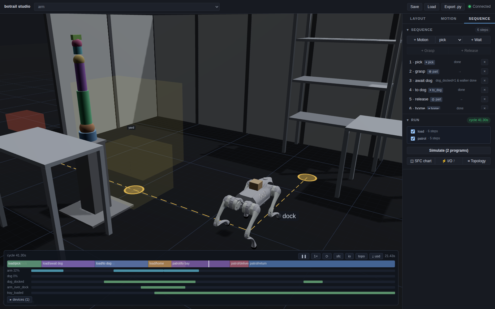

# Legged robots

A quadruped or a humanoid is, to the cell, a [vehicle](vehicles-and-amr.md)
with legs. It is sent with `goto`, it arrives with `device_done`, it carries
what sits on its back or in its hands, and it has to fit through the gate
like any AGV. What the vehicle vocabulary lacks is the legs — and that is
all `bt.Gait` adds: which links are the feet, how the machine stands, and
the rhythm it walks to.

```python
dog = bt.Robot.from_urdf("go2.urdf")
gait = bt.Gait(
    legs={"FL": "FL_foot", "FR": "FR_foot", "RL": "RL_foot", "RR": "RR_foot"},
    stance={"FL_hip_joint": 0.0, "FL_thigh_joint": 0.8, "FL_calf_joint": -1.5, ...},
    pattern="trot", period=0.45, lift=0.07, max_stride=0.45, foot_radius=0.022,
)
scene.add_robot(dog, name="go2")
scene.add_vehicle("walker", body=["go2/footprint"], path=[YARD, DOCK, BAY],
                  stations={"yard": 0, "dock": 1, "bay": 2}, speed=0.6, turn_speed=1.0)
scene.mount_robot("walker", robot="go2", gait=gait)   # stands it on the floor

sq.step("to dock", actions=[bt.seq.goto("walker", "dock")],
        transition=bt.seq.device_done("walker"))
```

The `goto` is what makes it walk. There is no walk action to author, any
more than there is a "spin the wheels" action for an AMR: the legs are a
property of the mount, the way a wheel's spin is a property of its axle.



## What is simulated, and what is not

Nothing physical. The body rides the vehicle's closed-form motion — a
straight at constant speed, a pivot at constant rate — exactly as an AMR's
base does. The moment the vehicle is dispatched, every footfall of the
drive is planned from that motion: a foot lands where its stance will be
centred under the body at mid-stance (a half-stance ahead on a straight, a
step around the origin on a pivot). From then on a planted foot never moves
in the world, and each leg is solved by IK every scan tick to keep it
there. After the vehicle stops the footfalls converge on the parked
positions by themselves, so the machine settles into its stance within a
cycle or so of arriving.

The one thing that makes a walk look wrong is a foot that slides. That is
the one thing this guarantees — and it is checked, not hoped for: the feet
on a baked timeline stay within a micrometre of their landings.

What it does *not* answer is whether the machine could actually walk:

* No balance, no contact forces, no slip, no falling over.
* Floors are the vehicle's plane: no steps, stairs or slopes.
* No acceleration — vehicles move at constant speed, legged or not.
* A leg's reach is checked (a stride the legs cannot take is refused by
  name, before or during the bake), its torque is not.

What it *does* answer is what it answers for any vehicle — does it fit,
does it clash, how long is the cycle — with legs that move like legs.

## The gait

| Field | Meaning |
|---|---|
| `legs` | Leg name → foot link, in the order the pattern's phase table is read: `FL, FR, RL, RR` for the quadruped patterns, `L, R` for `biped`. A value may be `(foot_link, contact)` to give one leg its own contact. |
| `stance` | Joint → value of the standing pose. Must name every leg joint; other joints keep their mount-time value. The feet must stand level (on one plane within 5 mm). |
| `pattern` | `walk` (duty 0.75, lateral sequence), `trot` (duty 0.5, diagonal pairs), `biped` (duty 0.6), or `custom` with `duty` and `phases`. |
| `period`, `lift` | Cycle time in seconds; swing apex above the floor in metres. |
| `max_stride` | The longest step a leg may take between two landings. `speed × period` (and the outer foot's arc in a pivot) must stay under it, or the vehicle's rates are refused by name. |
| `foot_radius` | How far the foot link's origin stands above the floor: a ball foot's radius, or an ankle frame's height over its sole. |
| `contact` | `point` (a ball: position only) or `sole` (flat on the floor, pointing where it landed). A sole's foot link must point +Z up in the stance; a 6-DOF leg keeps it flat *and* pointed, a 5-DOF leg keeps it flat. |
| `arm_swing` | Joint → amplitude swung in step with the first leg — a biped's arms. Left alone while the robot holds something or a ramp is driving them. |
| `bob`, `lateral` | Body sway while walking: up and down twice a cycle, over the planted leg once a cycle. The legs absorb it; the feet do not move. |

Mounting with a gait stands the robot on the vehicle plane (the offset is
derived from the stance; pass `offset_position` to override) and puts it
into its stance. Standing, the legs are yours to ramp — a crouch is a ramp
like any other — but a leg joint cannot be ramped mid-walk, and a walk
cannot start while a ramp is still moving a leg. Planned motions cannot
start while the vehicle drives, for the same reason as on an AMR: a plan
is baked in world coordinates.

## The body, the aisle, and the load

The vehicle's `body` is the aisle check. A legged robot's links are a
robot, not a body, so give the vehicle an invisible **footprint** box —
`set_obstacle_visible(name, False)` — sized to the machine; a gate too
narrow for it fails with `VehicleCollision` naming the panel. Mounting with
a gait marks the robot's links as allowed to touch that footprint (it
stands inside it), so it never counts as a collision.

The legs themselves are checked too, while the vehicle moves: a link or a
held part that meets the environment fails with `RiderCollision`, naming
the link and the obstacle. This is the same check an AMR's arm gets while
its carrier drives.

Anything set down inside the vehicle's `tray` rides along — a part placed
on a quadruped's back by an arm is cargo the moment it is released, with no
load action. A humanoid carries in its hands: `attach` the part to a hand
link, and it rides still through the walk (the arms do not swing with full
hands).

## Humanoids

Two legs, soles instead of balls, arms that swing, a body that bobs:

```python
g1 = bt.Robot.from_urdf("g1_29dof_rev_1_0.urdf")
gait = bt.Gait(
    legs={"L": "left_ankle_roll_link", "R": "right_ankle_roll_link"}, contact="sole",
    stance={...}, pattern="biped", period=0.85, lift=0.05, max_stride=0.5,
    foot_radius=0.035,                     # the ankle frame sits 35 mm over the sole
    arm_swing={"left_shoulder_pitch_joint": -0.25, "right_shoulder_pitch_joint": 0.25},
    bob=0.015, lateral=0.02,
)
```

Two things worth knowing before you teach one:

* **Bend the knees.** A leg stood nearly straight has no reach left for
  the foot that stays planted while the body moves off — the first
  half-period of every walk stretches it by half a stride. A stance with
  the knees at 0.8 rad walks where one at 0.5 rad fails by name.
* **Arm ramps are not planned.** A ramp from "arms at the sides" to "arms
  forward" swings the forearms through a bench at hip height, even though
  both end poses are clear. Teach an intermediate pose (out and up, then
  in), and check every ramp the way `examples/humanoid_carry_demo.py`
  does: sample it and ask `check_collisions()` — the demo refuses to bake
  a ramp that sweeps through the cell.

## From the catalog

A legged machine in the catalog is a `vehicle.legged` package, and its
manifest carries the gait: which links are the feet, the stance it
stands in, the rhythm it was validated to walk with (the catalog builder
stands every such package on its stance and walks it through a pivot
before it ships). `Gait.from_catalog` reads that block, so a cell copies
no joint name out of a URDF:

```python
dog = bt.Robot.from_catalog("unitree/go2/go2")
gait = bt.Gait.from_catalog("unitree/go2/go2", period=0.5)   # keywords override
scene.add_robot(dog, name="go2")
scene.mount_robot("walker", robot="go2", gait=gait)
```

A package directory on disk works the same way — `bt.Gait.from_catalog(
"build/unitree/go2/go2/r1")` reads the `manifest.yaml` a local `bcb build`
wrote — and a package that is not legged is refused by name. Beside the
gait, the manifest's `specs` say what the cell needs to size the body the
gate sees (`footprint_mm`, `height_mm`) and cap the vehicle's speed
(`max_speed_mps`); `examples/legged_patrol_demo.py --compare` bakes one
cell on every package named and tables which fit and how long they take.

## Reading the bake

`timeline.footfalls(robot)` lists every step as `(leg, lift, land,
(x, y, z))`; `timeline.base_pose(t, robot)` carries the body's sway. The
cycle time is the vehicle's: walking costs no time over driving, which is
to say a legged robot is budgeted like any other vehicle, by its path and
its speed.

Script export (`to_script`, `export_script`) refuses a walking robot — its
joints are its legs, and no controller takes a gait as a program. The cycle
belongs to the PLC side (`export_plcopen`), where the vehicle is a device
like any other.

## Examples

* `examples/legged_patrol_demo.py` — a Unitree Go2 (the catalog package
  `unitree/go2/go2` when it is reachable, else Unitree's URDF with the
  meshes converted on first run) walks in through a gate, docks, has a
  part placed on its back by an arm, and carries it to the bay. `--robot
  <dir>` runs it on a package the catalog builder wrote, `--robot quad` on
  the primitive quadruped in `examples/quad_test.urdf` with no download;
  `--narrow` shows the gate check failing; `--compare <dir> ...` tables
  every candidate.
* `examples/humanoid_carry_demo.py` — a Unitree G1 picks a tote off a
  bench, carries it to another, sets it down and walks back. `--robot
  biped` runs it on `examples/biped_test.urdf`.
