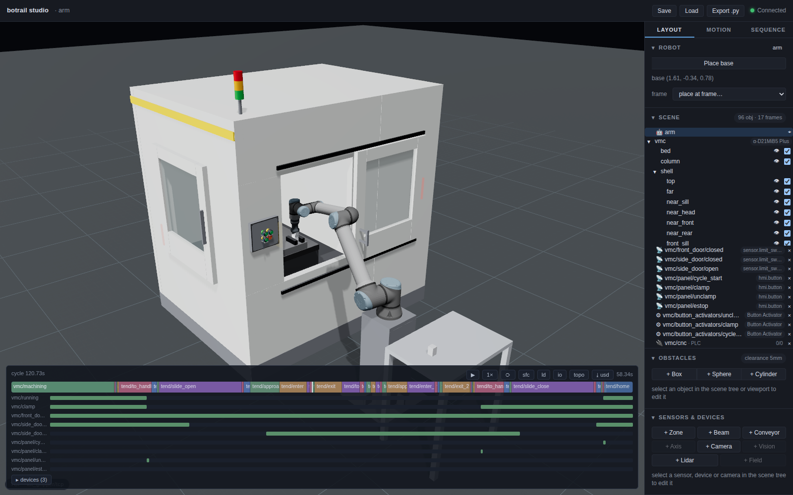
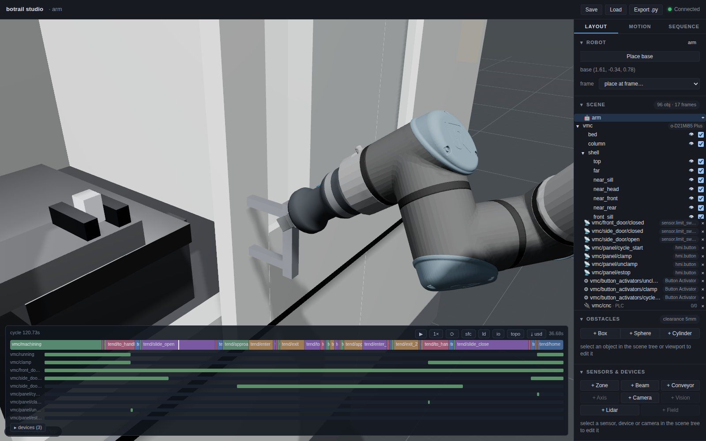
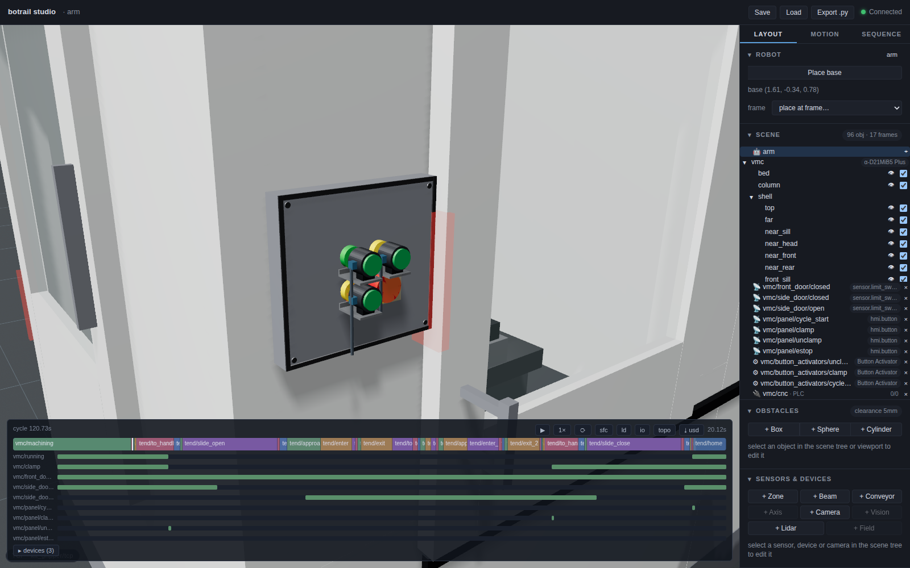

# Machine tending

A robot at the side door of a machining centre, swapping the finished
part in the vise for a blank between cycles — the cell every machine-tool
builder photographs. botrail builds it from products and public figures:
the machine is the *envelopes* a tending cell verifies against, its
behaviour is one more PLC program scanned beside the robot's, and a
button is a zone sensor as deep as its stroke.

```python
import botrail as bt

vmc = bt.parts.machine_tool(scene, "vmc", door="servo", door_side="right",
                            panel="door", buttons=("cycle_start", "clamp", "unclamp", "estop"))
(tx, ty, tz), _ = scene.frame("vmc/table")
vise = bt.parts.vise(scene, "vise", (tx + 0.25, ty, tz), opening=0.054)

hs = bt.tending.fanuc_ri2(scene, vmc, cycle_s=42.0, clamp_s=0.8, notice_s=5.0)
tend = scene.sequence("tend")                       # the robot's program, by hand
tend.step("wait", transition=bt.seq.signal(hs.signal("notice")))
...
tl = scene.simulate_sequences(["tend", hs.program])
```



The worked example is
[`examples/machining/machine_tending_demo.py`](https://github.com/neka-nat/botrail/blob/main/examples/machining/machine_tending_demo.py):
a UR12e on a catalog robot stand at a ROBODRILL-sized machine
with no robot interface — the retrofit — worked through its door and its
panel using a Robotiq Hand-E for the part and door handle, and three
panel-mounted Robotiq Button Activators for the buttons.

## The machine as envelopes

[`bt.parts.machine_tool`][botrail.parts.machine_tool] stands a vertical
machining centre as boxes, all of them collision-checked, none of them a
shape: the enclosure with its front and side openings, the **table at its
exchange position** (a table that traverses to the door is what a robot
reaches), the **spindle head** retracted over it, the **side door leaf**
sliding along the wall, and an **operator panel**. Without arguments it
is the FANUC ROBODRILL α-D21MiB5 Plus of the public catalogue — the side
auto-door opening 705 × 869 on an 827 mm sill, the 650 × 400 table, the
250–580 mm nose-to-table — and every figure is a parameter. The one
number the catalogue does not print, the table's height above the floor,
defaults to 0.90 m and is the first to replace when the drawing is at
hand.

Why boxes: what a tending cell verifies is whether the arm and the part
pass the opening, whether the wrist clears the head, whether the door
shuts on anything — and those are answered by the opening, the head and
the leaf, not by the sheet-metal profile a few centimetres away. A
vendor's CAD, where its licence allows, layers over these as a mesh
(`scene.load_usd`) and changes nothing the cell verifies.

Frames come with it: `<name>/table`, `<name>/entry` (where an arm waits,
150 mm outside the leaf), `<name>/door/side/handle`, and one per button.
A plan that does not fit is refused with the numbers — an opening off its
wall, a stroke off the body, a head through the roof — the way a wall
plan that does not close is.

### The door

`door="servo"` or `"air"` makes the leaf a **linear axis**
`<name>/side_door` with two named stops: `bt.seq.move_to(door, "open")`
opens it at the speed its drive is published to run (a servo door covers
800 mm in 0.8 s where an air cylinder takes 2 s), `move_to(door,
"closed")` shuts it, and the stops' lanes `<name>/side_door/closed` and
`/open` are the limit switches an interlock is written from — on the
chart as lanes, on the I/O list as inputs. `door="manual"` leaves the
leaf loose for a robot that takes the handle — attach the `door_objects`
and run a `cartesian_line` along the wall — and two zone sensors under
the same names read the loose leaf at its ends.

The door enforces itself. What an axis drives is checked against every
robot each tick, the way two arms are checked against each other: a leaf
the machine closes on an arm still inside stops the bake at that tick
with a `DeviceCollision` naming the door, the leaf, the robot and the
link. The classic mistake — the exchange reported done before the arm is
out — is exactly that error, at the second the leaf meets the forearm.

### Buttons

[`bt.parts.operator_panel`][botrail.parts.operator_panel] puts a grid of
22 mm pushbuttons on a plate. Each is a cap (drawn, never collided), a
**zone sensor the size of the cap and as deep as the operating travel**,
sitting just inside the cap face, and two frames — `<panel>/<button>` on
the face and `<panel>/<button>/press` 2.6 mm in, both with +Z into the
panel. A tool that touches the cap reads nothing; one that pushes it the
travel a 22 mm actuator has turns the input on for as long as it is held.
Nothing moves: the stroke is a depth, and the input is the meaning. The
E-stop is the ø40 mushroom with its 44 N on the bill, and the neighbour's
zone is the check that a wide tool did not press two.

### The vise

[`bt.parts.vise`][botrail.parts.vise] stands a vise on the table with
its jaws `opening` apart and the frame `<name>/jaw` on the jaw floor
between them. Clamping is a signal the machine's program writes, not a
jaw that moves; an opening past the vise's maximum is refused.

## Ordering the machine

The envelopes are what a catalog pack carries. A machine tool's pack
(`kind: spec`, category `machine_tool.vmc`) has no geometry — it has
`mechanical.envelope` (the openings with their sills and strokes, the
table, the spindle nose to table), the options the maker sells
(`column_mm`, `side_door`, `door_side`), the published door times, and
an `interface`: the handshake template and the maker's signal table. Pass
its id and the generator reads all of it:

```python
vmc = bt.parts.machine_tool(scene, "vmc", catalog="fanuc/robodrill/alpha-d21mib5-plus",
                            side_door="servo", door_side="right", panel="door", buttons=BUTTONS)
vise = bt.parts.vise(scene, "vise", (tx + 0.25, ty, tz), catalog="botrail/fixture/vise-125",
                     jaw_width=0.125, opening=0.054)
hs = bt.tending.fanuc_ri2(scene, vmc)        # checks the pack's template
```

A drive the pack does not sell is refused with the ones it does, and a
door a robot slides (`door="manual"`) takes the pack's leaf and stroke
without ordering a drive; the machine, its side door and its panel land
on the bill with the pack's article numbers; a pushbutton box (`botrail/hmi/button-box-22`) orders
the same way by its number of positions. And the opening decides the
arm before anything is taught: `scene.requirements()` asks the robot
beside the machine for the reach to its table, so
`bt.catalog.search_for` lists the arms that can serve it. The demo's
`--catalog` builds the cell this way.

### A lathe

[`bt.parts.lathe`][botrail.parts.lathe] is the turning counterpart: the
Haas ST-10 of the public spec pages as boxes — a 3.20 m body, the front
door opening centred on the spindle, the headstock and the spindle nose
`<name>/spindle` (+Z along the axis toward the tailstock), the turret's
envelope beside it — and the same door vocabulary on the *front* door,
which is the one a robot loads through: a linear axis with `closed` /
`open` stops, or a loose leaf with two limit switches. The chuck is a
part of its own, mounted on the spindle frame:

```python
lathe = bt.parts.lathe(scene, "lathe", door="manual")
chuck = bt.parts.chuck(scene, "chuck", *scene.frame("lathe/spindle"), opening=0.050)
hs = bt.tending.manual(scene, lathe, buttons=("unclamp", "clamp", "cycle_start"))
```

`<chuck>/face` is what a load aims at — a part comes in along its -Z,
the jaws stand proud of the face around the gripping diameter, and
`bt.tending` takes the lathe as it takes a machining centre (its one door
is the front door, so no door-exclusivity guard applies). What no public
page prints — the opening, the spindle's height and depth — are design
values, the first to replace from a drawing.

## The machine's program

A machine tool is not a device the robot commands. It runs a part program
and talks in a fixed vocabulary — for FANUC's Robot Interface 2: `M62`
announces the end of the cycle early, `M60` unclamps and opens the side
door, SERVICE REQUEST holds while the door is at its open end, the robot
asks for the work clamp and reports the exchange done, the door shuts
before the next cycle. [`bt.tending.fanuc_ri2`][botrail.tending.fanuc_ri2]
authors that as a sequence of its own, and the cell runs two programs:

```python
hs = bt.tending.fanuc_ri2(scene, vmc, cycle_s=42.0, clamp_s=0.8, notice_s=5.0)
hs.signal("service_req")    # the name the robot's program waits on
hs.signal("clamp_req")      # the one it writes
tl = scene.simulate_sequences(["tend", hs.program])
```

Request and acknowledge run on levels, the PLC way: the robot raises
`clamp_req`, the machine answers `clamp`, the robot drops the request
once it sees the answer; `service_ok` goes up **after the arm is out**
and comes down when it is home. The template also declares the CNC as an
I/O node hosting the machine's program, so the derived I/O list shows the
handshake as wires between two controllers and the PLCopen export carries
the machine's POU on a resource of its own.

[`bt.tending.manual`][botrail.tending.manual] is the retrofit: no
interface, the robot presses UNCLAMP, CLAMP and CYCLE START on the panel
and slides the door itself. The machine program waits on the buttons'
rising edges — and on the door's closed lane for the start, so a start
pressed with the door open is ignored, the way a guard interlock ignores
it, and the bake reports the deadlock naming the step.
[`bt.tending.haas_autodoor`][botrail.tending.haas_autodoor] is the Haas
vocabulary — `M80`/`M81` work the door only while the cell-safe input is
on, cycle start closes it — and
[`bt.tending.generic`][botrail.tending.generic] the vendor-neutral
request/acknowledge most relay interfaces reduce to, with
`signals={role: name}` to carry the maker's own tags onto the I/O list.

Whatever the vocabulary, every template writes the same three guards
into the machine's program, the way ISO 16090-1 has a machining centre
written: the side door opens only with the **front door closed** (the
machine has a closed switch on it, `vmc.front_door_lane`); a cycle starts
only with the side door **confirmed at its closed end** — the switch, not
the command; and nothing starts with the **E-stop** pressed
(`vmc.estop`, the panel's mushroom). They are what the
[interlock table](#handing-over) reads back as rows.

## The commercial hand and panel actuators

The demo follows the [Robotiq Machine Tending Solution](https://robotiq.com/solutions/machine-tending):
a single Hand-E handles the workpiece and opens/closes the door by gripping
its handle. Button Activators stay fixed over UNCLAMP, CLAMP and CYCLE START.
The robot carries no lateral pusher or fork and needs no tool exchange.

```python
arm = bt.Robot.from_catalog("universal_robots/ur/ur12e/r1")
kit = bt.Robot.from_catalog("robotiq/hand-e/hand-e-ur-es-077-kit/r1")
robot = arm.attach_tool(kit, prefix="kit_")
```

The kit includes the ES-077 coupling selected for a female-wrist UR12e.
Robotiq confirms that [UR12e retains UR10e solution compatibility](https://blog.robotiq.com/knowledge/understanding-the-difference-between-ur10e-and-ur12e).
The longer arm keeps both the vise and the door's full stroke reachable
with the compact Hand-E.
The catalog Hand-E uses standard overmolded fingers with 50 mm opening;
the demo's 40 × 40 × 60 mm workpiece leaves 5 mm clearance per side.
The TCP-to-pad offset is accounted for when teaching both the part and handle.



The three Button Activators are authored runtime reference geometry in
`examples/machining/_robotiq_tending.py`, using `bt.parts` and boxes. Each
moving foot drives only its own button's zone sensor. The simulated CNC still
waits for sensed presses; the arm program does not write the button inputs.
Bracket/body dimensions are visual estimates, while the stroke comes from
the cell's button geometry. Their pneumatic speed is a simulation setting.



This is a component-based simulation reference, not a qualified standard
Robotiq package. Three independent pneumatic channels, controller/URCap
configuration, status-light detection, actual door effort, full mounted
load/CoG and physical installation remain to be verified. The default kit
includes one Button Activator; the other two are additional components.

## What the bake says

Every lane of the handshake is on the chart in the order it happened —
door, request, clamp, buttons — and readable with
[timeline assertions](timeline-assertions.md):

```python
assert tl.signal("vmc/side_door/open").rising_edges()[0] <= tl.step_span("tend/enter").start
assert tl.signal("vmc/side_door/closed").rising_edges()[-1] > tl.step_span("tend/exit_2").end
assert tl.signal("vmc/panel/estop").high_spans() == []
```

The bill lists the machine, its door with the drive and the stroke, the
panel and each button with its head size, travel and force, the vise and
the stand; the I/O list, the topology and the PLCopen file come from the
same source. See [the I/O map](io-map.md) and
[offline commissioning](offline-commissioning.md).

## Two machines, one arm

[`examples/machining/two_machine_cell_demo.py`](https://github.com/neka-nat/botrail/blob/main/examples/machining/two_machine_cell_demo.py)
stands two ROBODRILL-sized machines facing each other across an aisle,
the arm on its stand between their side doors and a bench per machine
beside it, and teaches the far machine with the same
`machine_tending_demo.teach` / `program` as the near one — prefixed
`a_` / `b_`, the shared park motion once. Each machine runs its own
`bt.tending.manual` program; the arm's program serves A, then B. With a
part program longer than the swap, the arm is the constraint, and the
bake says by how much: `tl.utilization("arm")` for the arm, the
`running` lane's high time for each spindle. The interlock table then
carries three programs, the PLCopen file three resources (`arm`,
`vmc_a_cnc`, `vmc_b_cnc`), and the handshake spec both CNCs.

Two things the far machine taught: a machine straight behind the base
sits at J1 = ±π, and the IK converges from one winding and not the
other, so the teach seeds both; and a straight-line move (take the
handle, slide, let go) must stay on one IK branch end to end, so the
four handle poses are solved as a chain from the tightest one, never
each from its own seed.

## Handing over

The demo's `deliver()` writes the cell's document set from the one
source — and three of its pages are what a machine-tending cell is
handed over with in particular:

* **The interlock table** ([`scene.interlocks()`](io-map.md#the-interlock-table)):
  every output of both programs against the condition that admits it.
  The machine's `cycle_start` row reads
  `(RISING(vmc/panel/cycle_start) AND vmc/side_door/closed AND vmc/front_door/closed AND NOT vmc/panel/estop)`
  — the three guards, as the control designer would write them down —
  and names the buttons as sensors on the CNC; the robot's `to_unclamp`
  row waits on `NOT vmc/running` and names the machine's steps that
  write it, which is the handshake read across the table.
* **The PLCopen file** with the machine's program as a POU on the CNC's
  own resource (`vmc_cnc`) beside the arm controller's (`arm`), so each
  side's IDE takes its own — the machine builder's PMC logic is a
  deliverable, not a description.
* **The layout sheet** with the door: a driven door draws its leaf at
  the open end of its travel (dashed) with the travel arrow; a loose leaf
  its two limit switches at the ends of the stroke — the envelope a plan
  keeps clear of the stand and the stocker.

And the **FAT rows**: the faults a control designer would test for are
authored as scenarios and run with the matrix —

```python
scene.add_scenario("door_switch_stuck", faults=[bt.io.stuck(hs.signal("door_closed"), False)])
scene.add_scenario("clamp_button_open", faults=[bt.io.open("vmc/panel/clamp")])
scene.add_scenario("estop_pressed", faults=[bt.io.stuck(hs.signal("estop"), True)])
runs = scene.simulate_scenarios(["tend", "vmc"], max_duration=160.0)
report = scene.cell_report({"baseline": tl}, scenarios=runs, deliverables=files)
```

— and the report's scenario matrix shows the baseline through and each
fault **refused**: the closed switch that never makes and the E-stop in
stall the machine at `wait_start`, the open wire on CLAMP at
`wait_clamp`. The report's *Machines* section lists the machine with its
door (drive, stroke, the lanes), its buttons and the controller hosting
its program.
