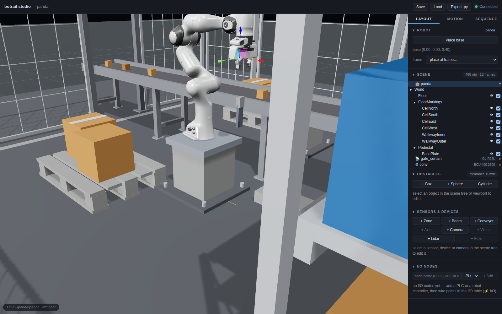
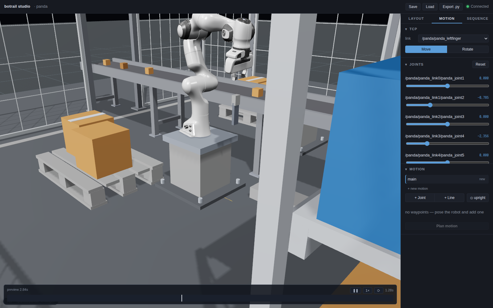
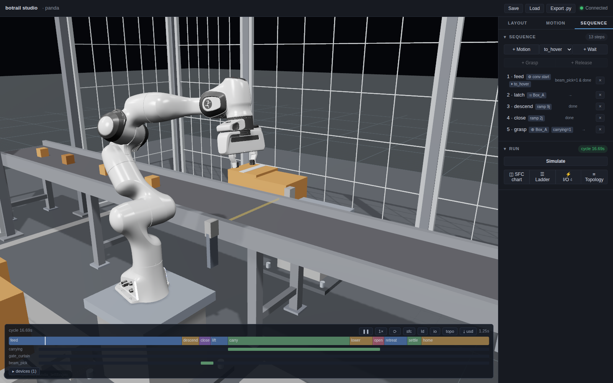
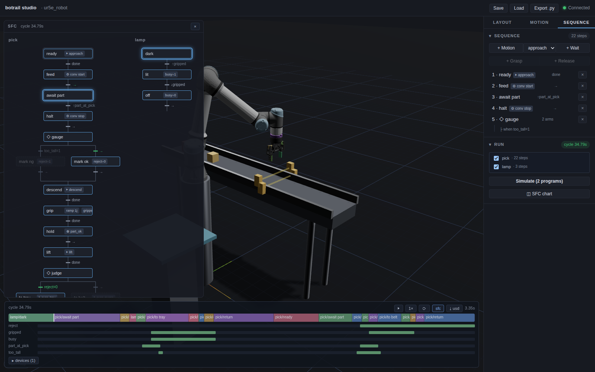

# The studio

`bt.studio(scene)` serves a 3D workbench for the scene on `127.0.0.1` and
opens your browser. The studio and your Python session hold **the same
scene**: drag the TCP gizmo and IK runs live with the result visible from
Python; call `scene.set_tcp_target(...)` and the browser's robot moves.
Everything the UI does, the API does — the two are one operation model over
one wire protocol.

```python
bt.studio(scene)                          # blocks until Ctrl-C
server = bt.studio(scene, block=False)    # keep the prompt (REPL / notebook)
server.url
server.stop()
```



The header names the robot (a dropdown when several share the scene, driving
every panel), holds the project buttons — **Save** / **Load** are `.botrail`
[projects](projects.md), **Export .py** is `generate_python()` — and shows
the connection dot. The viewport is a full orbit camera over the cell, with
the TCP gizmo on the end-effector and the active TCP link named in the
corner badge.

The sidebar is three workflow tabs. **LAYOUT** builds the world: robot
placement, the scene tree, obstacles, sensors & devices. **MOTION** poses
and teaches the selected robot: TCP, joints, waypoints — the things used
together. **SEQUENCE** programs the cell and runs it. Sections collapse
from their headers, and the studio remembers the open tab and the sections
you keep closed. Picking in the viewport follows along — clicking an arm
raises MOTION, clicking an obstacle raises LAYOUT — except while SEQUENCE
is up, since picking a part or an arm there is how grasp steps are
authored.

## Placing the robot — ROBOT

The base pose, editable two ways: **Place base** for dragging it, or the
*place at frame* dropdown to snap it onto any named frame — the studio form of
`scene.set_robot_base_pose(*scene.frame(...))`.

## The cell inventory — SCENE

The scene tree: robots, then the world's obstacles as imported (the counter
reads e.g. *147 obj · 5 frames*), then sensors and devices. The tree is
*the* list — click an obstacle (here or in the viewport), a sensor, or a
device and its editor opens in the section below, inspector style.
Colliding obstacles read red right in the tree. Per obstacle, the eye
toggles display and the checkbox includes/excludes it from collision
checking (`set_obstacle_enabled`); removal sits in the editor form (and on
sensor/device rows).

## Posing — TCP and JOINTS

The TCP panel picks the IK link (the dropdown defaults to the model's TCP
link — on the Franka that is a fingertip, so pick the hand link for grasp
work) and switches the gizmo between **Move** and **Rotate**. Dragging solves
IK continuously; collision turns the offending geometry red as you go. The
JOINTS panel is the other door into the same state: one slider per joint.

## Teaching motions — MOTION

The panel lists every motion in the scene — Python-authored ones included —
with owner and waypoint count. Pick one to edit it (picking another robot's
motion also switches the robot, so waypoints always fit), or **+ new
motion** to start another; it is created the moment its first waypoint
lands. Below sits the waypoint-segment editor, mirroring
[`add_segment`](motion-planning.md#named-motions-waypoint-segments): pose the
robot, then **+ Joint** or **+ Line** appends a segment ending at this
configuration (`upright` adds the orientation-cone constraint that keeps the
tool vertical). **Plan motion** solves the whole list rest-to-rest and plays
the preview in the timeline dock, with a tick at each segment boundary:



The green readout is the plan: duration, segment count, planning time. A
quick A→B check is a one-waypoint motion — pose the goal, **+ Joint**,
**Plan motion**. Trajectories planned from Python against a live session
(`plan_to_pose`) preview in the same dock.

## The process — SEQUENCE and RUN

Steps accumulate here the way `sq.step(...)` writes them: add a motion step
from a named motion, a one-second timer step, a grasp/release step for the
selected obstacle. The **RUN** section below holds everything about the
next run: with several programs authored (one per station, PLC style), its
checkboxes pick which roll together; the dropdown picks the world —
`baseline` or a Python-authored scenario delta (`add_scenario`);
**Simulate** bakes the cycle and broadcasts the timeline to the dock:



## The chart — SFC

**◫ SFC chart** (in RUN, or the `sfc` button on the dock) overlays the
programs on the viewport in the notation PLC programmers already read —
and everyone else reads as a flowchart: one column per program, step
boxes joined by transition bars with the condition beside each, a ◇ step
fanning into one lane per arm and rejoining below. After a Simulate the
chart is the bake's story: steps that ran are outlined, arms the world
never took are dashed out, and the guard that won is green — so a
[scenario](sequences.md) that flips a verdict shows up as the other arm
lighting up on the next Simulate.



During playback a token rides each program's active step, and the live
condition beside it answers *why is it waiting*: each contact turns green
as it becomes true, timers count up (`0.29/5.00s`), and edge conditions
(`↑part_at_pick`) underline while the signal is high. Just after the
token hops, the condition that released it keeps glowing at the old spot
for a beat, so the cause of every transition stays readable at playback
speed. Clicking any baked step seeks the transport to the moment it
began; the chart stays up across reloads until closed.

## The timeline dock

The bottom dock is the one transport bar: every playback — a motion
preview, a baked cycle, a loaded recording — plays and scrubs here. For a
baked sequence it is a timing chart: the cycle time (*cycle 15.56s* above),
one colored band per step, and one lane per signal — internal relays,
sensors, device running-states. The playback cursor drives the viewport.
Recordings loaded with `play_usd_animation` — including two-robot bakes and
Isaac captures — play through the same dock.

## Serving details

```python
bt.studio(scene, host="127.0.0.1", port=0, open_browser=True, block=True)
```

`port=0` picks a free port. The server binds localhost and serves the bundled
UI; in a source checkout build it first (`./scripts/build_studio.sh`) or point
`BOTRAIL_STUDIO_DIR` at a built studio `dist/`. Several browsers can connect
to one scene — they all see the same state, live. And the studio also runs
[with no server at all](browser-only.md).
