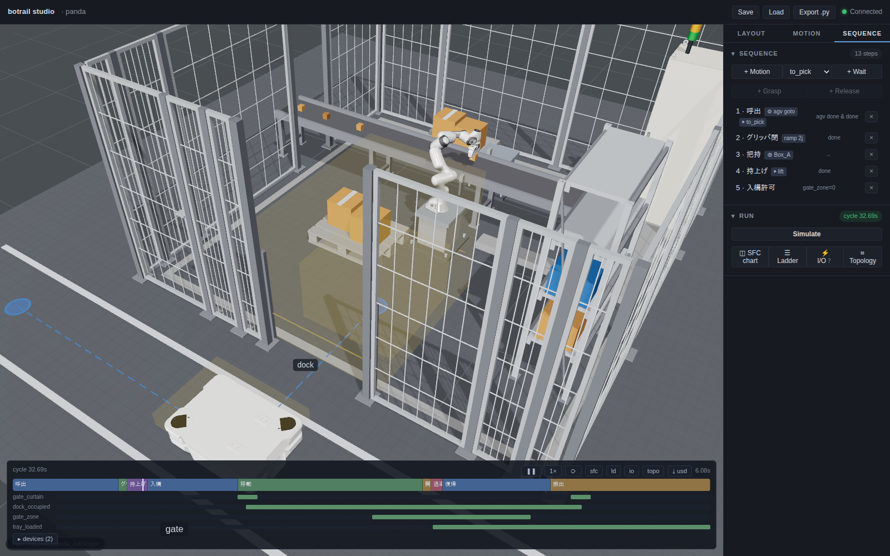

# Vehicles and AMRs

An AGV is not a special kind of robot in botrail — it is a
[device](sensors-and-devices.md), the same standing as a conveyor or a
linear axis. That is how a cell PLC sees one: you send it a destination and
wait for a completion signal. Everything else follows from that.

A cell of vehicles and conveyors needs no robot at all: `bt.Scene()` opens
empty, and the bake, the tracks, the studio and the USD export all run
without one. Everything robot-implicit (`scene.robot`,
`set_joint_positions()` without a `robot=`) answers by name — `scene has
no robot; add one with add_robot` — instead of assuming a first robot.

```python
scene.add_vehicle(
    "agv",
    body=["/World/AGV"],                       # obstacles carried rigidly
    path=[(-2.6, -2.9), (0.0, -2.9), (0.0, -1.15)],
    stations={"warehouse": 0, "gate": 1, "dock": 2},
    speed=0.8, turn_speed=math.radians(45),
    start="warehouse",
)

sq.step("call", actions=[bt.seq.goto("agv", "dock")],
        transition=bt.seq.device_done("agv"))
```

`goto` is the dispatch order and `device_done` is "in position" — the same
pair a linear axis uses. The vehicle's moving state is an output lane on the
timing chart, next to the conveyors.



The studio draws the guide path on the floor with a marker at each station,
and the timing chart carries the vehicle's lane alongside the sensors it
handshakes with — here `dock_occupied`, `gate_zone` and `tray_loaded`.

## Travel is authored, not planned

The `path` is the model of the tape on the floor. botrail does not plan
routes, avoid dynamic obstacles or run SLAM: it drives the path you taught
it, exactly, every time. That is the same bargain the rest of the tool makes
— [determinism](../concepts/determinism.md) in exchange for scope.

Between waypoints the vehicle drives straight at `speed`; where the path
turns it pivots in place at `turn_speed`. Both bake to closed-form spans, so
any resample rate is exact. The **arrival heading is the last leg's
direction**, which means the waypoint before a station is what decides how
the machine docks.

Waypoints are `(x, y)` or `(x, y, z)` — z is the floor height on the
guidance surface, so a ramp climbs with its waypoints. The body stays level
(heading only; no pitch), cruise speed is spent along the 3D path, and a
path that climbs needs `max_grade` — the steepest rise over horizontal run
the machine may take (`0.10` = 10 %). Without it only level paths pass
validation, and a slope is refused naming the waypoints and the angle. A
vertical stack of waypoints is never *driven* — that hop is a **lift
edge**: legal only when both ends sit in a lift's capture zone at its
stops (see [lifts](sensors-and-devices.md#lifts)), ridden by commanding
the lift, and never walked by `goto` — a station across the edge is
refused with directions to drive to the near side, ride, and continue.

### Holonomic drive — mecanum wheels

`drive="holonomic"` translates the machine in any direction while holding
its heading: no pivot turns, ever — it docks facing whatever it faced when
parked (the whole point of buying those wheels), and a corner costs only
its length. `allow_reverse` does not exist here, since there is no turning
around to avoid; the z rules stay a ground drive's (`max_grade`, lift
edges). `examples/amr_demo.py --holonomic` runs the AMR cell that way.

### Aerial drive — a drone is a vehicle too

`drive="aerial"` makes the machine a multirotor: z becomes its own axis,
so the path climbs, dives and hangs vertical legs freely — no `max_grade`,
no lift, and no takeoff command (the pad station under an overhead
waypoint *is* the takeoff, as a vertical leg).

```python
scene.add_vehicle("drone", body=["drone"],
                  path=[(0.5, 0, 0), (0.5, 0, 2.4), (2.0, 1.1, 2.4)],
                  stations={"pad": 0, "hover": 2},
                  speed=0.8, drive="aerial",
                  climb_speed=0.6, descent_speed=0.9)
```

`speed` is the horizontal cruise; each leg's clock is the slower axis —
`max(run / speed, rise / climb_speed (or descent_speed))`, closed form.
The nose faces each leg's course, or holds `fixed_yaw` the whole flight
(a camera that must keep facing the racks). Everything else is the same
vehicle: stations and `goto`, the tray rule, mounted sensors riding the
airframe — and the same tick checks. Against parked scenery those checks
say nothing an obstacle check would not; where they earn their keep is
**two machines sharing space in time**. The drone demo's corridor crosses
a working arm's bench at working height — inside the arm's reach by
design, forbidden by geometry alone — and an interlock (`arm_clear`, a
PLC bit the arm's program raises when it stows) is what makes the cell
legal. The cross-robot check prices the pair of clocks every tick: drop
the interlock (`--no-interlock`) and nothing about the paths changes, yet
the bake refuses at the instant the machines meet, naming a link of each.
`examples/drone_survey_demo.py` runs the survey beside the arm's own
program (`--low` shows the other failure: a corridor too low even for the
stowed arm).

The airframe itself comes from the catalog like any other machine —
`px4/x500/x500`, the PX4 reference 500-class quadrotor — and **a UAV is a
robot mounted on an aerial vehicle**, the exact symmetry of a quadruped on
a differential one (legged = Robot + gait + vehicle; UAV = Robot + rigid
mount + vehicle):

```python
x500 = bt.Robot.from_catalog("px4/x500/x500")
scene.add_robot(x500, name="drone")
scene.add_vehicle("drone", body=[], path=..., drive="aerial", ...)
scene.mount_robot("drone", robot="drone")     # rides rigidly, gear on the pad
```

Being a robot is what buys it interference computation: its links against
the shelving while it flies (`RiderCollision`), its links against other
robots' links every tick (the refusal above names both links), and the
live distance readout while you author. A vehicle with no body of its own
whose rider is a robot *is* that robot, so the BOM lists one machine on
one line — the robot's, with the manifest's identity. The manifest's
`specs.max_climb_mps` / `max_descent_mps` are what the machine is capable
of; the cell states what it will actually use, which indoors is far less.

`body` names the obstacles carried rigidly. Entries match an obstacle
exactly or as a subtree prefix, so `body=["/World/AGV"]` picks up everything
under it.

### Two things a vehicle forces that a conveyor never did

**Ground clearance is real.** The aisle check (below) tests the body against
everything it does not carry — including the 3 mm painted lines on the
floor. Model the chassis with the ground clearance a real machine has, and
give the parts that genuinely touch the floor `set_obstacle_enabled(name,
False)` so they are scenery rather than body.

**A turn sweeps wider than the body.** A pivot swings the body's
half-diagonal, so the clearance that decides whether a dock works is the one
*around the turn*, not along the straight. If a dead end has no room for
that, pass `allow_reverse=True` and the vehicle backs out instead of turning
around in it — which is what a differential-drive machine does anyway.

## The aisle check

While a vehicle is travelling, every scan tick tests its body and its load
against everything else. A contact is a hard, timestamped failure:

```
vehicle `agv` collides with `/World/Pallet/DeckBoard_1` at t = 10.570s
(body part `agv/base`); widen the aisle or re-teach the path
```

This is the mobile counterpart of the arm's collision checking, and it is
deliberately not something the tool tries to solve for you: the fix is a
wider aisle or a different path, both of which are layout decisions.

The check runs **only while the vehicle moves**, so a parked machine resting
against its dock guide is legitimate authoring rather than a false alarm.

## Carrying things: the tray

A `tray` is a zone in the vehicle's own frame. Anything unattached whose
origin is inside it rides along, rotation included:

```python
scene.add_vehicle(..., tray_position=(0.0, 0.0, 0.37), tray_size=(0.84, 0.62, 0.12))
```

There is no load or unload action, and that is the point — it is the
[conveyor's zone rule](sensors-and-devices.md#conveyors) moved onto a moving
frame. A part the arm sets down on the deck simply becomes cargo on the next
tick; one the arm picks back up stops being cargo, because a grasp wins over
a deck.

On a [legged](legged.md) vehicle the deck is the machine's *body*, not its
route: the zone is placed on the body link and the load is bound to it, so
on a flight the load climbs and tilts with the back it rides. Nothing about
the authoring changes — the tray is still stated in the vehicle's frame.

!!! note "Rest the load on the collision surface"
    If the vehicle body is a mesh, collision runs on its convex
    decomposition, and the convex hull of a dished top fills the dish. The
    deck the checker sees can sit a few millimetres above the one you can
    see, and placing a part on the drawn surface is then rejected as a
    collision. Raise the place pose until it clears; the gap is invisible.

## Sensors that travel

A sensor can ride a vehicle by naming it in `mount`. Its geometry is then
read in that vehicle's frame and re-resolved every tick:

```python
scene.add_zone_sensor("tray_loaded",
                      position=(0.0, 0.0, 0.37), size=(0.84, 0.62, 0.12),
                      watch=[CARTON], mount="agv")
```

The difference is not cosmetic. A floor-mounted zone reports the carton for
the moment it is set down and loses it the instant the machine pulls away; a
mounted one still answers "loaded" out on the aisle, which is what a
departure permit has to be able to ask.

## Mounting an arm: the AMR

Put a robot on a vehicle and its base stops being a scene constant:

```python
scene.mount_robot("amr", offset_position=(0.0, 0.0, 0.31))
```

From here the base is *derived* from the vehicle's frame every tick, and
everything downstream — FK, collision, sensors, grasped objects, the studio,
the USD export — follows without any special handling, because all that
changed is where the links are.

Two rules come with it:

* **A planned motion cannot start while the vehicle is driving.** A plan is
  baked in world coordinates when it starts, so a base moving underneath it
  invalidates every waypoint. The rollout rejects it by name rather than
  producing nonsense. Wait for `device_done` first.
* **A ramp can.** Ramps are re-evaluated every tick, so the arm can fold
  itself into its stow *while* the machine travels — which is what a real
  AMR does between stations, and why the stow costs no cycle time.

One taught pose often serves several stations, incidentally: the base is the
deck, so a stand that sits 0.65 m to the machine's left is in the same place
at every station it visits. That is the whole idea of a mobile manipulator,
and it falls out of the mounting rather than needing anything extra.

## Carriers from the catalog

A mobile base is a [catalog](robots.md#the-model-catalog) product like any
other (`vehicle.amr`), and it answers the four questions a cell has for a
machine it did not design. Read them out of the package instead of typing
them in, and swapping the carrier stays an argument rather than an edit:

```python
carrier = bt.Robot.from_catalog("rb-kairos", format="usd")   # geometry + frames
package = Path(bt.catalog_package("rb-kairos"))
specs = yaml.safe_load((package / "manifest.yaml").read_text())["specs"]

probe = bt.Scene(carrier)                     # FK once, in a scene of its own
deck = probe.link_pose(carrier.flange_link)   # where the arm bolts on
for piece in sorted((package / "collision").glob("*.stl")):
    pose = probe.link_pose(piece.stem)        # …and the body, piece by piece
```

* **`frames.flange_frame`** surfaces as `carrier.flange_link`: the mount
  plate, and so the arm's `mount_robot` offset. `specs.deck_height_mm` says
  the same thing on the data sheet.
* **The `collision/` meshes** are the body — place each at its link's pose
  (a `format="usd"` package names links by prim path, so match the last
  segment) and hand the group to `add_vehicle(body=[...])`. What drives the
  aisle is then the geometry you can see.
* **Their union** gives the footprint, and its half-diagonal is the pivot
  swing that decides corners.
* **`specs`** carry `max_speed_mps` (derate it — vehicles here run at
  constant speed) and `payload_kg` for the load chain: carrier ≥ arm +
  gripper + part, arm ≥ gripper + part, gripper ≥ part. One of the three is
  always the binding one.

`examples/amr_demo.py --compare` bakes one authored cell on every carrier
the catalog ships and prints what each answers.

## Legs instead of wheels

A quadruped or a humanoid is the same vehicle with a gait on its mount:
`scene.mount_robot(device, robot=..., gait=bt.Gait(...))`, and the `goto`
that dispatches the vehicle is what makes it walk. See
[Legged robots](legged.md).

## What this does not model

Worth stating plainly, because the vocabulary invites bigger expectations:

* No navigation — no SLAM, no dynamic obstacle avoidance, no route planning.
* No fleet dispatch or traffic management. One vehicle's deterministic cycle
  is in scope; deciding which of twenty vehicles goes where is not.
* No docking error, wheel slip, protective-field slowdowns or battery.
* No acceleration model: vehicles move at constant speed. If your machine's
  ramp-up distance is a large fraction of a leg, derate the speed you give
  it rather than using the spec maximum.

For arrival variation, sweep it rather than sampling it — see
[parameter sweeps](../tutorials/parameter-sweep.md) and
`examples/agv_sweep_demo.py`, which prints how late a dispatch may be before
the cell starts waiting on it.

## Examples

* `examples/agv_cell_demo.py` — an AGV serving the factory cell: called
  while the arm picks, held outside the gate by an interlock, loaded on the
  deck, released once its own load sensor says it has the part.
* `examples/amr_demo.py` — a carrier, an arm and a gripper straight out of
  the catalog: the machine fetches a part from a bench in the aisle, carries
  it on its own deck, and hands it to a conveyor in a machining bay, folding
  the arm away on the move. `--carrier NAME` swaps the base; `--compare`
  bakes the same cell on every mobile base the catalog ships.
* `examples/agv_sweep_demo.py` — dispatch delay and dock depth as
  deterministic response curves.
