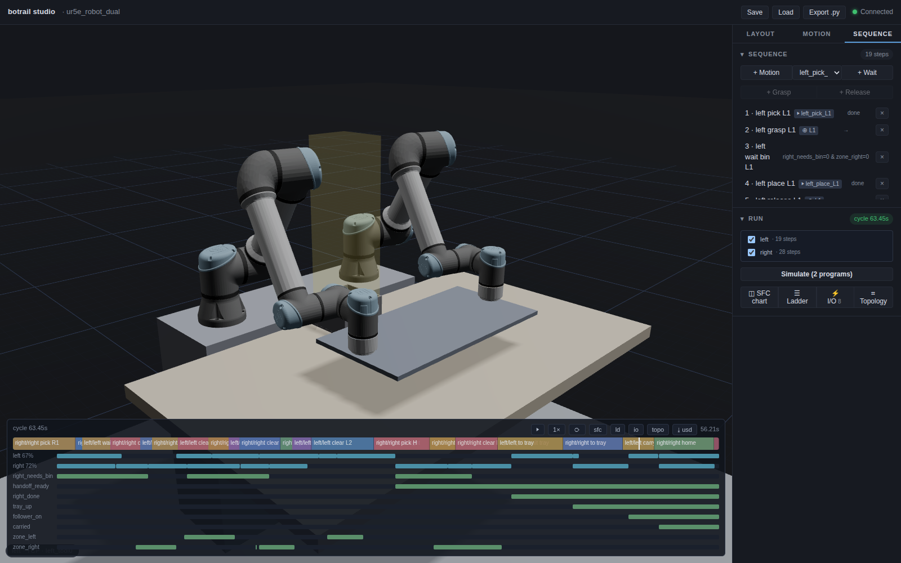

# Two arms, one robot

*Walks through [`examples/multi_robot/dual_arm_demo.py`](https://github.com/botrail/botrail/blob/main/examples/multi_robot/dual_arm_demo.py)
— a dual-arm kitting cell: one robot, two arms, one program per arm.*

[Two arms, one belt](two-robots.md) put two robots in one cell. This tutorial
puts two arms on one robot: two UR5e on a shared torso, modelled the way a
dual-arm product (an OpenArm, a YuMi) or a pair of arms on one controller is —
as a single `Robot` whose **planning groups** are its arms. Everything you know
takes `group=`, and the rollout drives the arms' joints independently.

The cell is a kitting station. A tray holds four parts, two per side; each arm
picks its own column and drops the parts into one bin between them. That bin's
airspace is contested, so the two arms' programs interlock the way a PLC would.
One part changes hands on the way. With `--carry`, the cycle ends by moving
the tray with both hands.

```bash
python examples/multi_robot/dual_arm_demo.py
```

```text
ur5e_robot_dual: 12 DOF, arms ['left', 'right'] (ur5e rig)
cycle time: 43.54s
  left  moving 27.18s of 43.54s (62%)
  right moving 35.08s of 43.54s (81%)
both arms in motion for 18.7s of it
kitted 4 of 4 parts: L1, L2, R1, R2 (L2 handed over)
exported to dual_arm_kitting.usda — view with: usdview dual_arm_kitting.usda
wrote dual_arm_kitting_left.script (left arm, 6 axes)
wrote dual_arm_kitting_right.script (right arm, 6 axes)
```

The UR5e comes from the [catalog](../guides/robots.md#the-model-catalog);
`--robot simple` runs the same code on two primitive arms from the checkout,
with no downloads (see [the offline rig](#the-offline-rig) below).



## One robot, two groups

```python
--8<-- "examples/multi_robot/dual_arm_demo.py:143:149"
```

`Robot.dual_arm` welds two single arms to a bare body and returns *one* model
of 12 DOF whose groups are `left` and `right`, each with its own tip
(`left_tool0`, `right_tool0`). It is the composite the rest of the script
talks to — `pair.group("left").joints` names the six left joints, and every
call that moves the robot takes `group=`. The joint vector interleaves the
arms (it is the tree's breadth-first order), which is why the script reads
joints by name and never by position. The
[Robots guide](../guides/robots.md#arms-of-one-robot) has the other ways in: a
product's own two-arm URDF, or `define_group`.

## Teaching an arm

```python
--8<-- "examples/multi_robot/dual_arm_demo.py:262:283"
```

`set_tcp_target(..., group="left")` solves the left arm's joints and leaves
the right arm exactly where it is — the mask is the group. IK knows nothing
about collisions, so the teach retries a few seed postures and keeps the first
solution whose `check_collisions()` is empty: the way a teacher jogs an arm out
of a fold before saving a point. Every pick is an approach plus a straight
descent, every place a straight lift and a move over the destination —
`add_segment(..., group=arm)` makes each motion the arm's own, and the planner
treats the *other* arm as a frozen obstacle when it plans.

## Two programs, one robot

The cell is written as two PLC programs, one per arm, sharing the robot:

```python
--8<-- "examples/multi_robot/dual_arm_demo.py:366:378"
```

A program may own an arm of a dual-arm robot the way it owns a robot — the
single-owner rule that keeps two programs from commanding the same resource is
enforced per arm. Grasps hang off the arm (`attach(part, group=arm)`), and the
rollout drives the two arms' joints side by side: a motion on one and a ramp
on the other bake together, and a second driver on a joint already in flight
is a hard error naming the move, never a silent overwrite.

The bin is the contested resource. One zone sensor per arm watches the column
of air over its mouth — a zone reports *somebody* is inside, not who, so each
arm needs its own — and the programs interlock through those zones and one
flag:

```python
--8<-- "examples/multi_robot/dual_arm_demo.py:220:225"
```

```python
--8<-- "examples/multi_robot/dual_arm_demo.py:380:402"
```

The right arm has priority: it announces a drop before it even picks
(`right_needs_bin`), and only enters while the left arm's zone is clear. The
left arm enters only while the right arm neither is inside nor has announced.
The zone is deliberately a narrow column: an arm reaching past the bin for its
tray column must not read as inside, or the two programs deadlock waiting on
each other — which is exactly what a wider zone did while this cell was being
written.

The hand-off is a flag too, raised once the giving arm has cleared, not at the
release: the taking arm's approach would otherwise be planned straight into
the tool that just let go.

## Carrying the tray with both hands

```bash
python examples/multi_robot/dual_arm_demo.py --carry
```

```text
cycle time: 63.45s
  left  moving 42.29s of 63.45s (67%)
  right moving 45.79s of 63.45s (72%)
both arms in motion for 24.7s of it
kitted 4 of 4 parts: L1, L2, R1, R2 (L2 handed over)
tray carried 0.12 m to (0.67, 0.00) with both hands
```

```python
--8<-- "examples/multi_robot/dual_arm_demo.py:404:419"
```

Nothing plans the two arms together. The left arm `attach`es the tray and
lifts it; the right arm then takes the far edge of the *raised* tray and
`track`s it — from that instant every tick solves the right arm's joints to
keep its hand where it latched on, wherever the left arm's planned carry takes
the tray. The order matters: the leader lifts first, so its lift is planned
against a follower that is beside the load, not in its way.

## What happens without the interlock

```bash
python examples/multi_robot/dual_arm_demo.py --clash
```

```text
unarbitrated, the arms are caught:
   arms `left` and `right` of `ur5e_robot_dual` collide at t = 9.230s
   (left_wrist_2_link × right_wrist_3_link); add an interlock
   (robot_done(group=) / a zone sensor on one arm) so one arm waits for the other
```

`--clash` drops both wait conditions. The arms head for the bin together, and
the rollout — which re-checks the two arms against each other every tick —
stops at the tick they meet, with the arms and the links named. A meeting is
not a warning; the bake fails.

## One controller program per arm

```python
--8<-- "examples/multi_robot/dual_arm_demo.py:464:470"
```

```python
--8<-- "examples/multi_robot/dual_arm_demo.py:517:523"
```

`export_script(..., group="left")` lowers the left program to a 6-axis
URScript: the left arm's joints only, its own moves only, the other arm's
zone and flags read on inputs. Leaving `group=` off a dual-arm robot is an
error, not a 12-axis program.

```text
def left():
  # Generated by botrail (units: rad, m, s)
  # joints: left_shoulder_pan_joint, left_shoulder_lift_joint, left_elbow_joint, left_wrist_1_joint, left_wrist_2_joint, left_wrist_3_joint
  movej([0, -1.9, 1.8, -1.5, -1.57, 0], a=6.283185, v=3.141593, r=0)
  # step 1: left pick L1
  movej([-0.461808, -1.219699, 2.18276, -2.533857, -1.570796, -2.032605], a=6.283185, v=3.141593, r=0)
```

## The deliverables know the arms

The [cell report](../guides/layout-and-report.md) lists each arm's busy time
under the robot's own row — the line-balancing figure between the arms:

```text
| robot | busy (s) | utilization |
|---|---|---|
| ur5e_robot_dual | 43.51 | 100 % |
| ur5e_robot_dual/left | 27.18 | 62 % |
| ur5e_robot_dual/right | 35.08 | 81 % |
```

The layout sheet draws a reach circle per arm, centred on the arm's own base,
from the UR5e's catalog `reach_mm`. The interlock table names the arm that
drives each row (`motion left_place_L1 (ur5e_robot_dual/left)`, with the
condition `(NOT right_needs_bin AND NOT zone_right)` beside it). And
`scene.requirements()` sizes the arms from their own bases — here one BOM line
for the two identical arms, `ur5e_robot_dual/left (x2)`, asking for
`reach_mm >= 706.9` ("farthest taught target 0.64 m from the left arm's base
(flange), +10%") against the 850 the catalog provides.

## The offline rig

```bash
python examples/multi_robot/dual_arm_demo.py --robot simple
```

```text
simple_arm_dual: 12 DOF, arms ['left', 'right'] (simple rig)
cycle time: 25.35s
  left  moving 18.89s of 25.35s (75%)
  right moving 22.41s of 25.35s (88%)
both arms in motion for 16.0s of it
kitted 4 of 4 parts: L1, L2, R1, R2
```

The same code on `examples/assets/simple_arm.urdf` twice, on a tighter cell
laid out for the primitive arm's reach. It kits, interlocks, clashes
(`--clash` collides at 5.82 s) and exports per arm; the hand-off spot and the
tray's edges fold it into itself, so the hand-over and the two-handed carry
are the UR5e rig's to show. This is the rig the regression suite runs
(`python/tests/test_dual_arm_demo.py`); the carry and the hand-over are
checked there too, whenever the catalog is cached.

## The complete script

[`examples/multi_robot/dual_arm_demo.py`](https://github.com/botrail/botrail/blob/main/examples/multi_robot/dual_arm_demo.py)
— `--studio` opens the cell in the [studio](../guides/studio.md), where the
TCP panel switches the gizmo between the arms and the timeline dock shows a
lane per arm.

## Next

* [Robots — arms of one robot](../guides/robots.md#arms-of-one-robot) for
  the group model, `define_group`, and a product's own dual-arm description.
* [Sequences — two arms of one robot](../guides/sequences.md#two-arms-of-one-robot)
  for `robot_done(..., group=)` inside one program.
* [Two arms, one belt](two-robots.md) for the two-robot build of a two-arm
  cell.
