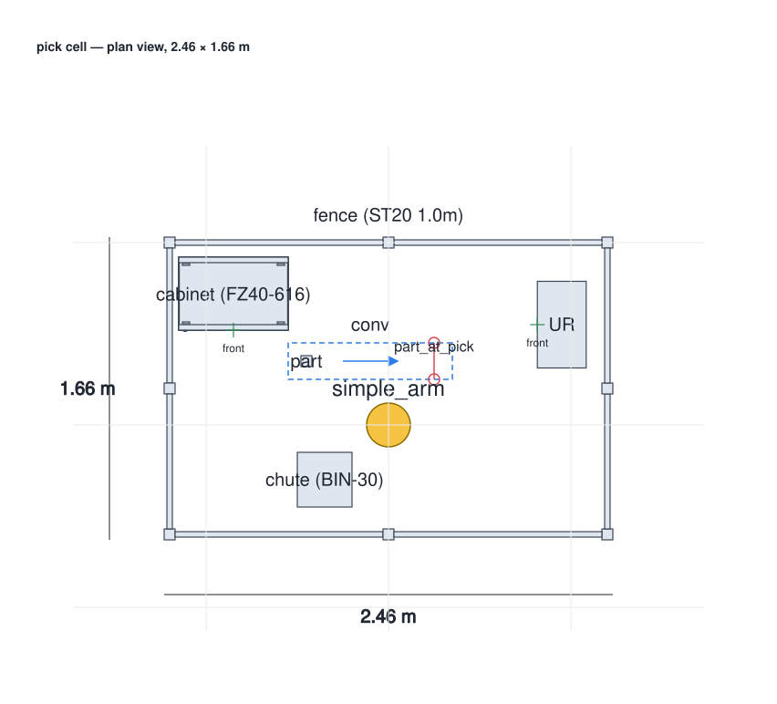

# Hand over the cell

*Walks through [`examples/cell_deliverables_demo.py`](https://github.com/botrail/botrail/blob/main/examples/cell_deliverables_demo.py)
— one script, the whole document set. Runs on the primitive-geometry arm from
the checkout, no downloads.*

A robot cell is not delivered as a simulation. It is delivered as a layout
drawing, a bill of materials, an I/O list, the control logic for the PLC, a
robot program, a review animation, and a page of numbers somebody signs off
on. In most toolchains
those live in five programs and drift apart the day the layout moves. Here
they are all *derived* from one scene — so they cannot disagree with each
other, or with the bake that verified the cell — and this tutorial writes
every one of them:

```bash
python examples/cell_deliverables_demo.py deliverables/
ls deliverables/
```

```text
cell.botrail        cell_bom.csv     cell_io.csv       cell_report.json  pick_cell.script
cell.plcopen.xml    cell_bom.md      cell_layout.dxf   cell_report.md
cell.py             cell_cycle.usda  cell_layout.svg   cell_topology.mmd
```

## The cell

The pick-and-branch cell of the [robot program](../guides/export.md#robot-programs)
example — a six-axis arm, a conveyor, a photo-eye, a spec-gauge branch, and a
UR controller wearing the I/O — furnished with scenery and identity so the
documents have something to say:

```python
--8<-- "examples/cell_deliverables_demo.py:34:62"
```

Three things to notice. The fence is generated by
[`bt.parts.fence`](../guides/standard-parts.md) — panels and posts as
obstacles under `fence/`, the door its own obstacle, and the
[parts](../guides/parts-and-bom.md) on the groups carrying the counts —
so changing `FENCE_PITCH` changes the panel and post counts on the BOM and
the panels on the sheet together. The controller cabinet is a box with
*no* part: it is the body of the `UR` I/O node, which already is a BOM line.
And every `set_part` names a product without changing the cycle at all —
identity is a separate layer from geometry and behaviour.

## Writing the set

```python
--8<-- "examples/cell_deliverables_demo.py:76:110"
```

Each line is one existing export; the only new step is the last one.
[`Scene.cell_report`][botrail.Scene.cell_report] takes the baked cycles, the
scenario sweep, and *the files just written*, and hashes them into the
report — so the report says, with digests, which drawing, which list and
which program belong to this cell.

## Reading the report

```text
--8<-- "docs/assets/deliverables/cell_report.md:1:12"
```

The rest of the page is the detail behind each line: step spans and robot
utilization per cycle, the I/O counts and node usage, the scenario table
(the stuck-beam row stalls, and says where), the BOM by category, the
footprint, and the deliverables with their SHA-256. All of it is also
`cell_report.json` — same numbers, one stable shape — which is what a
regression test or an agent reads:

```python
report = demo.deliver(demo.build(), out_dir)
assert report.cycle_time("baseline") <= 12.0
assert report.io["unbound"] == 0
assert report.bom["unidentified"] == 0
assert report.footprint["area"] <= 5.0
```

## The sheet and the list

The layout sheet is the scene from above — footprints, the robot base, the
conveyor zone with its direction of travel, the beam, the fence labelled as
one thing — as SVG for the review and as DXF for the plant's 2D CAD
([the guide](../guides/layout-and-report.md) lists what goes on which
layer):



The BOM has a line per product, merged and counted, with the totals the
parts declared:

```text
--8<-- "docs/assets/deliverables/cell_bom.md"
```

## Why hashes

Because the set is derived from one source, it is a *unit*. Run the script
again and every file is byte-identical. Move the photo-eye and exactly the
layout sheet and the generated Python change — the BOM and the I/O list do
not. Add a fence panel and the BOM changes too. The repository's own test
suite pins that behaviour by name
([`python/tests/test_deliverables.py`](https://github.com/botrail/botrail/blob/main/python/tests/test_deliverables.py)),
which is the regression a document set could never have when each document
was typed in by hand.
