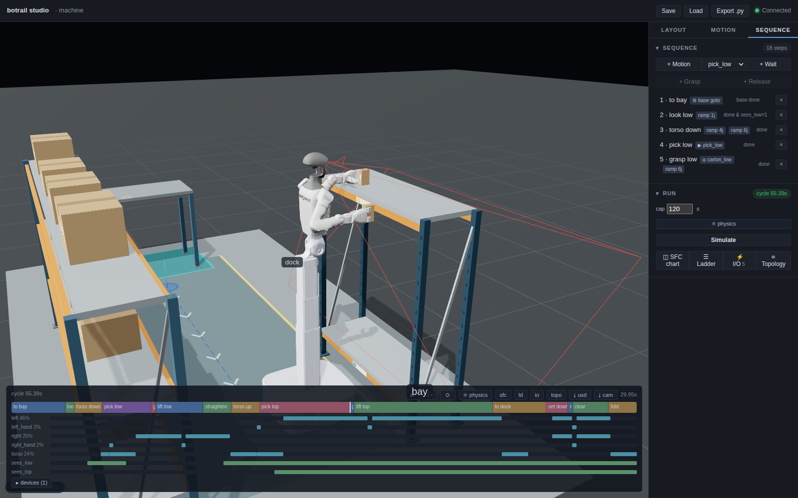

# A semi-humanoid picks a shelf

*Walks through [`examples/vehicles/semi_humanoid_demo.py`](https://github.com/botrail/botrail/blob/main/examples/vehicles/semi_humanoid_demo.py)
— a humanoid upper body on a wheeled base taking the low board and the top
board of one bay, a carton per hand.*

A semi-humanoid is bought for one thing a cobot on a cart cannot do: it works
from the floor to over its head, because its **torso moves its arms' bases**.
To a cell it is nothing new. It is a [vehicle](../guides/vehicles-and-amr.md)
with no body whose running gear is the robot itself, and a
[robot whose joints fall into groups](../guides/robots.md#more-than-arms) —
two arms, a torso, hands, a head. This tutorial asks the four questions a
cell asks of any mobile machine — does it fit the aisle, does it reach, does
it clash, how long does it take — and the one this kind adds: *how low and
how high does it have to work*.

```bash
python examples/vehicles/semi_humanoid_demo.py
```

```text
Unitree G1-D (catalog `unitree/g1/g1-d/r2`); aisle 1.40 m
cycle time: 55.39s
  to bay         0.00 –   4.75s
  look low       4.75 –   5.55s
  torso down     5.55 –   8.05s
  pick low       8.05 –  12.37s
  grasp low     12.37 –  12.77s
  lift low      12.77 –  16.98s
  straighten    16.98 –  19.48s
  torso up      19.48 –  21.98s
  look top      21.98 –  21.98s
  pick top      21.98 –  29.96s
  grasp top     29.96 –  30.36s
  lift top      30.36 –  42.62s
  to dock       42.62 –  47.37s
  torso stand   47.37 –  47.37s
  set down      47.37 –  49.29s
  release       49.29 –  49.69s
  clear         49.69 –  52.89s
  fold          52.89 –  55.39s
at the bay (4.75s) the wheels have turned: Left_Wheel_Joint +20.4 rad, Right_Wheel_Joint -27.9 rad
torso: low {'Yaw_Joint': 2.0}, top {'LZ_mt_Joint': 0.21, 'LZ_it_Joint': 0.21}, stand as it travels
carton_low ends at (-0.45, 0.20, 0.90) — on the stand
carton_top ends at (-0.45, -0.20, 0.90) — on the stand
```

The machine is a Unitree G1-D from the
[catalog](../guides/robots.md#the-model-catalog) — a two-stage lift column, a
waist that bows and turns, two 7-axis arms with three-finger hands, a
differential base; the first run fetches it into the botrail cache.
`--robot rby1` is a Rainbow Robotics RB-Y1 A, whose torso is a six-joint leg;
`--robot rby1m` (the same on mecanum wheels), `--robot ffw` (a ROBOTIS AI
Worker FFW-SG2, a lift column on swerve modules), `--robot galbot` (a Galbot
G1, a five-joint torso on omni wheels) and `--robot r1pro` (a Galaxea R1 Pro, a
four-joint torso on swerve modules) are machines that do not turn;
`--robot semi` runs the same cell on the primitive machine in
`examples/assets/semi_humanoid_test.urdf`, with no download (see
[the offline machine](#the-offline-machine)). `--compare` puts all of them in
front of one bay ([Which machine for this bay](#which-machine-for-this-bay)).



## The robot is its own vehicle

```python
--8<-- "examples/vehicles/semi_humanoid_demo.py:592:599"
```

The vehicle has `body=[]`: there is no chassis box, because the robot's own
links are the chassis — they are what the aisle check drives, in the posture
the machine actually travels in. `mount_robot(wheels=...)` is the statement
that this robot *is* the vehicle's running gear
([The robot is the vehicle](../guides/vehicles-and-amr.md#the-robot-is-the-vehicle-a-semi-humanoid)):
its wheel joints turn by exactly what the vehicle drives, it stands on its
base frame, it is put in its travel posture, and the BOM lists one machine.
The printed wheel angles are that closed form — the machine backs 2.4 m out
of the dock, turns a quarter, and drives the last 0.35 m nose first, and the
G1-D's left wheel counts the other way because its axis points the other way.

The dock is the path's *end*. A parked vehicle faces the leg it arrived by, so
the machine starts nose to the hand-off stand, and with `allow_reverse` it
arrives at the bay nose first as well — one quarter turn in the whole trip.

Everything about the wheels and the groups comes out of the package:

```python
--8<-- "examples/vehicles/semi_humanoid_demo.py:522:528"
```

## The torso first, then the arm

An arm is planned *without* the torso. Its group leaves the lift and the
waist out on purpose: a plan that moved them would move the other arm's base
under whatever it holds. So a reach is two moves — a **ramp** puts the torso
where the target needs it, then a **planned motion** takes the hand there —
and the two have to agree: the arm's poses are solved with the torso where
the ramp will have put it.

Which torso posture? The machine description lists candidates per task,
gentlest first, and teaching keeps the first one the hand reaches all of the
task's targets from, collision-free:

```python
--8<-- "examples/vehicles/semi_humanoid_demo.py:767:791"
```

For the G1-D that prints `low {'Yaw_Joint': 2.0}`: `Yaw_Joint` is the waist's
*pitch* (the vendor's name — the catalog's validation report says so), and the
machine reaches a carton 0.30 m over the floor by bowing 115 degrees into the
bay. The top board is the two column stages, 0.42 m. Ask for a posture it
does not have and the refusal lists every candidate with what stopped it —
`the right hand cannot take (2.60, 0.66, 0.30), 60 mm short`.

Every pose is solved with the machine **standing where it will work**
(`Stand.at("bay")` puts the base where the vehicle will carry it, the mount's
offset and all), so the bay's boards and posts are in the collision check at
teach time. What comes back is a joint vector, and a joint vector is relative
to the base: it lands on the same spot in the machine's frame wherever the
machine stands.

Two details of the arm's motions are worth stealing:

* **Solve the most constrained pose first**, and its neighbours from it. A
  7-axis arm has a posture for every target; a straight line between two
  taught poses only exists if they are the same posture, moved.
* **Back straight out before turning away.** The top carton comes out in a
  Cartesian line, level, until it has cleared the board's front edge, and
  goes on in a line into the carry. Planned as a joint move, the same hand
  swings the carton through the board — and the planner's way around it
  costs seconds.

```python
--8<-- "examples/vehicles/semi_humanoid_demo.py:737:765"
```

## Ramps are yours to check

A planned motion is checked along its path. A ramp is not — its path is the
author's — and the rollout only checks a *riding* robot against the cell
while its vehicle moves. So the demo samples each torso sweep at the station
it happens at, before the bake:

```python
--8<-- "examples/vehicles/semi_humanoid_demo.py:884:897"
```

It earns its keep at once. Ramping the G1-D from its bow straight to the top
posture is refused:

```text
g1d: the `torso up` ramp sweeps through the cell: [('head_link', 'bay/board_top')]
```

Raised as it stands, a bowed torso brings its head up under the top board.
Hence the cycle's `straighten` step: upright first, then up.

## The head camera is an input

```python
--8<-- "examples/vehicles/semi_humanoid_demo.py:625:629"
```

A [vision sensor](../guides/sensors-and-devices.md#vision-sensors) behind the
head camera is a signal: ON while the watched carton is in the view frustum
with a clear line of sight. Each pick waits for it:

```python
--8<-- "examples/vehicles/semi_humanoid_demo.py:974:974"
```

The glance itself is taught like the torso: the machine description lists
glances gentlest first, and teaching keeps the first that frames the carton —
the geometric half of what the sensor judges, asked of the carton's corners —
and gets there without sweeping the cell. A fixed head makes that matter: the
G1-D looks down by bowing — 0.3 rad is enough, because its head camera already
looks 47.6 degrees down (the package's `head_camera` frame: the vendor's frame
of the legged G1's head camera, on the head the two machines share) — and a
glance that frames nothing, or sweeps the carried hand onto a board, is refused
at teach time with every candidate's reason, not found out in the bake.

So a bay that was not replenished stalls the cycle at the glance, by name
(``timed out after 60s waiting in step 8 (`look top`)``), instead of closing a
hand on air. The two lanes at the bottom of the timeline show the geometry doing the
gating: the low carton comes into view with the glance down; the top one
stands on a board over the machine's eyes and only appears as the torso rises
past it. The G1-D's head is fixed, so its glance is a bow (`look` is a torso
posture); the primitive machine has a pan-tilt head and a group for it.

## The fold rides the drive

```python
--8<-- "examples/vehicles/semi_humanoid_demo.py:987:988"
```

A planned motion cannot start while the vehicle drives — a plan is baked in
world coordinates — but a ramp can, and that is how the column comes down from
the top board's height *on the way home*. The ramp's samples bake into the
same joint track as the turning wheels, so the fold costs no cycle time. At
the stand both arms set down at once: two motions in one step, each planned
with the other arm frozen and the pair re-checked every tick.

## What the cell asks of the machine

```python
print(scene.bom().to_markdown())
print(bt.select.requirements(scene, timeline=tl).to_markdown())
```

```text
| line | category | requirement | basis | provided | status |
|---|---|---|---|---|---|
| machine | vehicle.mobile_manipulator | payload_kg >= 0.35 | grasps carton_low 0.35 kg | 3 | ok |
|  |  | vertical_reach_min_mm <= 302 | lowest taught hand position 0.30 m over the floor (right, `pick_low`) | 0 | ok |
|  |  | vertical_reach_max_mm >= 1532 | highest taught hand position 1.53 m over the floor (left, `lift_top`) | 2000 | ok |
|  |  | arm_count >= 2 | arms taught: left, right | 2 | ok |
|  |  | max_speed_mps >= 0.8 | travel speed | 1.5 | ok |

Notes:
- machine: reach_mm is not asked of a machine that moves its own arms' bases — the cell asks its working heights (vertical_reach_*), and whether a machine reaches them is its teaching's and its bake's to say
```

One line: the vehicle is not a second purchase and there is no controller
box. `vertical_reach_min_mm` / `vertical_reach_max_mm` are derived for a
machine mounted as its vehicle's wheels — the lowest and the highest taught
hand position over the floor it stands on — and they are what tells a lift
column from a bowing waist from a fixed pedestal when
[shopping the catalog](../guides/selection.md).

There is no `reach_mm` row, and the note says why. An arm on a fixed base is
asked its reach — the farthest taught target from its first joint — because that
distance is the cell's: the base stands where the layout put it. This machine
takes its arms' bases to the work, so how far a hand is from its shoulder is its
own way of standing there; another machine lifts, bows or squats differently.
A requirement is not a remark: a stated figure that falls short of one is an
error in `scene.check()` and a filter in the catalog search, and this one would
have filtered out the very machine whose cycle had just baked. What the cell
does ask is the working heights — and whether a machine reaches them is what
teaching and the bake say, one machine at a time
([Which machine for this bay](#which-machine-for-this-bay)).

`--deliverables DIR` writes the whole [hand-over set](hand-over.md) from the
same bake — project, generated script, BOM, I/O list, PLCopen, interlocks,
layout sheet, USD and the cell report. The generated script re-authors the
mount (`wheels=bt.Wheels(...)`) and bakes to the same cycle time; the robot's
own controller script is left out, by name: a machine with several groups is
one program per arm.

`--aisle 0.9` answers the first question. The check is the machine's own
links against the row across the aisle:

```text
cycle failed: robot `machine` riding `base` collides with `row/uprights/c3` at t = 0.060s (`AGV_link`); widen the aisle or re-teach the path
```

## Which machine for this bay

Each machine's own run has its own bay — boards where *that* torso has to move
to reach them. `--compare` asks the buyer's question instead: **one** bay
(`--robot`'s), the same aisle, the same way of teaching it, every machine.

```bash
python examples/vehicles/semi_humanoid_demo.py --compare --robot semi
```

```text
bay: boards at 0.75 m and 1.50 m; aisle 1.40 m
machine  torso, low board                                     torso, top board                                       cycle   verdict
g1d      Yaw_Joint 0.4                                        LZ_mt_Joint 0.21, LZ_it_Joint 0.21                         —   step 11 (`lift top`): planning failed: segment 1: cartesian line failed at 59%: IK did not converge (unreac...
rby1     torso_1 1.2, torso_2 -2.4, torso_3 1.2               as it travels                                         71.08s   ok
rby1m    torso_1 0.9, torso_2 -1.8, torso_3 0.9               as it travels                                         66.55s   ok
ffw      lift_joint -0.2                                      as it travels                                         73.11s   ok
galbot   leg_joint1 0.8, leg_joint2 2, leg_joint3 1.2         leg_joint2 2.3, leg_joint3 1.4                        63.25s   ok
r1pro    torso_joint1 -0.7, torso_joint2 2, torso_joint3 1.3  torso_joint1 -0.6, torso_joint2 1.6, torso_joint3 1        —   step 9 (`pick top`): planning failed: segment 1: cartesian line failed at 60%: IK did not converge (unreach...
semi     lift_joint 0                                         lift_joint 0.4                                        52.85s   ok
```

and in front of the G1-D's bay, whose low board is 0.25 m over the floor
(`--compare` alone):

```text
bay: boards at 0.25 m and 1.45 m; aisle 1.40 m
machine  torso, low board                                     torso, top board                                       cycle   verdict
g1d      Yaw_Joint 2                                          LZ_mt_Joint 0.21, LZ_it_Joint 0.21                    55.39s   ok
rby1     —                                                    —                                                          —   no torso posture reaches `low` — the closest is 140 mm short
rby1m    —                                                    —                                                          —   no torso posture reaches `low` — the closest is 87 mm short
ffw      —                                                    —                                                          —   no torso posture reaches `low` — the closest is 120 mm short
galbot   —                                                    —                                                          —   no glance shows the low carton
r1pro    —                                                    —                                                          —   no torso posture reaches `low` — the closest is 196 mm short
semi     —                                                    —                                                          —   no torso posture reaches `low` — the closest is 263 mm short
```

Four ways of making height, and they show. The column machines have no way
down to 0.25 m. The RB-Y1 squats 0.45 m and still ends 140 mm short of a
*level* hand on that carton — the postures that put it there fold the machine
into its own base. The Galbot G1 folds its leg and reaches both boards of that
bay, and is stopped by its eyes instead: its head tilts 28 degrees down, and
from where it travels that does not show a carton 0.30 m over the floor. (The
package has no camera link; the camera is this cell's reading of the head's
mount frame, so that verdict is about the reading as much as about the
machine.) The G1-D bows 115 degrees and takes it; in front of the other bay it
is taught both boards (a bow of 0.4 rad, the column up) and then the bake
stops it at the top one: 1.58 m up, its level hand has no room to back the
carton 0.17 m straight out from under the board — the line runs out of arm at
59 %. The Galaxea R1 Pro finishes in front of neither: this cell holds the torso
still while an arm works and pulls a carton 0.15 m straight towards the body,
and an elbow that folds 100 degrees keeps that wrist more than 0.35 m from its
shoulder — what is left between too near and too far is millimetres wide. A
cell that let the torso lean back with the pull would suit it; that is the
cell's procedure speaking, and the table says which step. None of the
verdicts is an opinion about the machine — each is this bay's requirement, met
or not — and they come from three places: the **package** (not to be had), the
**teaching** (no torso posture of the ones the machine description lists puts
the hand on the board, with how far off the best one is; no glance that shows
the carton), the **bake** and the checks before it (a sweep through the bay, a
body that brushes the aisle).

Four of the seven do not turn. A holonomic base — the RB-Y1 M's mecanum wheels,
the AI Worker's and the R1 Pro's swerve modules, the Galbot G1's omni wheels —
[docks facing whatever it faced when parked](../guides/vehicles-and-amr.md#holonomic-drive-mecanum-wheels):
in the cell above it would arrive side-on to the bay. The machine description
says so (`holonomic=True`) and the cell is laid out by it — the stand on the
bay's side of the aisle, the dock up a spur of its own so the machine parks
nose to the racks, and the drive a crab along the aisle: 3.1 m in 3.9 s, against
4.75 s for the turning machines' 2.75 m and a quarter turn. The bay, the aisle
and the teaching are the same, which is what makes the rows comparable.

The RB-Y1 added two lines to what a machine description has to say:

* **How a level hand gets back into the carry is asked, not assumed.** A
  7-axis arm's carry and its taught poses may be different postures of one
  hand, and no straight line joins two postures — it dies part way with
  `configuration jump (IK branch change)`. Teaching asks the planner: it
  authors a one-segment motion from where the hand leaves to the carry, plans
  it, and [removes it again](../guides/motion-planning.md#named-motions-waypoint-segments) (`scene.remove_motion`), so
  nothing of the question is left in the project. A return that has a line
  keeps the hand level all the way; one that has not is a planned move. Of the
  RB-Y1's four returns three are lines — and the straight lines that matter,
  out from under the boards, are not up for the question at all.
* **A carry below the board backs out over its edge first.** A torso that
  squats carries lower than it picks: straight from over the low carton into
  that carry cuts the board's front edge (`carton_low x bay/board_low`), so
  teaching adds a pose that pulls the hand back over the edge — only when the
  carry is below the board.

It also says something about collision shapes. RB-Y1 r1 checked its wrist with
the vendor's capsule — 75 mm in radius and long enough to wrap the hand and
whatever it holds, which suits a self-collision check and means the hand can
never come within 75 mm of a board. The cell pins `…/rb-y1-a/r2`, where the
wrist has its own shape; [what may touch](../guides/collision.md#self-collision-and-the-inter-robot-acm)
is declared, not inflated.

## The offline machine

`--robot semi` is a primitive-geometry semi-humanoid from the checkout: a lift
column, a waist yaw, a pan-tilt head, two 4-axis arms with one-finger hands
whose twin is a mimic. It has no package, so the script declares what a
package would:

```python
--8<-- "examples/vehicles/semi_humanoid_demo.py:529:538"
```

Its bay is its own — boards at 0.75 m and 1.50 m, where a 0.40 m column makes
the difference between reaching and not — and its cycle is what
`python/tests/test_semi_humanoid_demo.py` pins: both cartons on the stand, each
pick gated by the camera, the fold on the move, one BOM line, the working
heights in the requirements, a narrow aisle refused by name.

A 4-axis arm adds one lesson of its own. Its hand can only be level in the
arm's own plane, so a Cartesian line between two taught poses exists only if
both have *exactly* the same attitude — a carry taught in joint angles that is
level to a hair is not level enough, and the line dies at 91 %. The carry is
therefore solved by IK with the same orientation as every other pose
(`back_to_carry` above).
